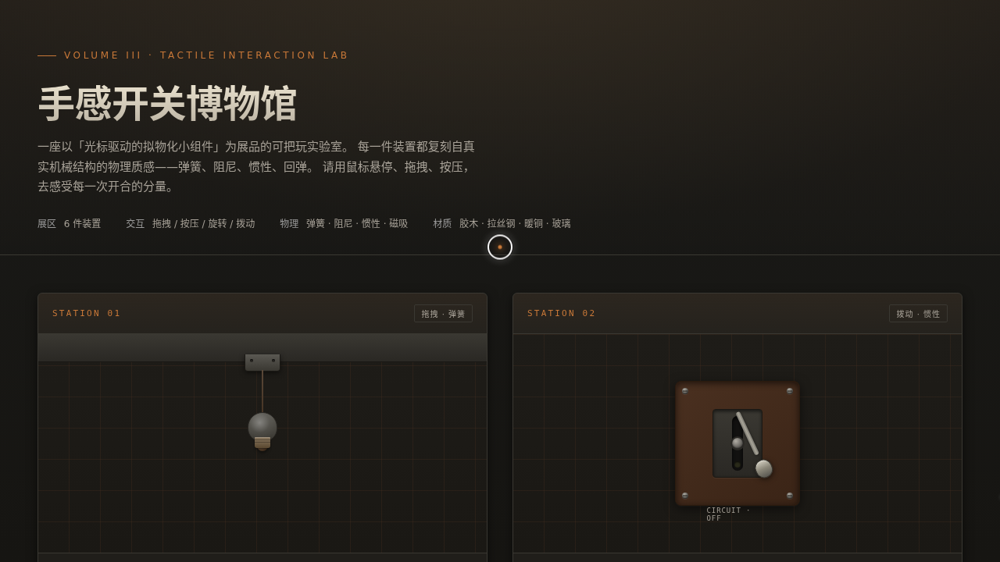

# 手感开关博物馆 · UX 交互实验室

> 日期：2026-08-17 · 方向：V3 UX 交互设计 · 主题：光标驱动的拟物化小组件动画

## 简介

一个以「手感」为核心的可把玩交互实验室，6 件拟物化机械装置，每件都用鼠标光标上手操作（悬停/点击/拖拽）才有意义。拉绳灯开关的弹簧下垂、拨杆的惯性回弹、旋钮的圆周调谐、滑动调光器的色温渐变、门铃的按压涟漪、摇杆的弹簧归中——所有动效基于 Hooke 弹簧 / 阻尼 / 惯性物理模型，rAF 单循环积分器驱动。

## 截图

## 动效亮点

- 自定义光标（白色粗环 + 暖铜内点 + 拖尾 + 悬停形态变化 + 点击涟漪）
- 拉绳灯开关：弹簧物理下垂 + 松手回弹 + 钨丝发光扩散
- 拨杆开关：阻尼惯性回弹 + 电路通电视觉反馈
- 旋钮调谐器：圆周拖拽 + 指针滞后弹性追踪 + 频率吸合
- 滑动调光器：连续亮度 + 冷白→暖黄色温渐变
- 按压门铃：弹簧按压形变 + 三层涟漪扩散 + 音频波纹
- 摇杆控制器：360° 拖拽 + 弹簧归中 + 40 颗粒子方向流

## 文件说明

| 文件 | 说明 |
|------|------|
| index.html | 完整可运行源码（纯 vanilla HTML/CSS/JS 单文件） |
| 设计规范.md | 色彩系统、字体、动效物理模型、展区结构设计文档 |
| thumbnail.png | 页面截图 |

## 在线预览

[手感开关博物馆·UX交互实验室](https://dcniaqwtmoca.feishu.cn/page/VjidmAvUidQgh1aJurxcS4EMnuf)

## 技术栈

纯 vanilla HTML/CSS/JS，零外部依赖，rAF 物理积分器（Hooke 弹簧/阻尼/惯性），支持 prefers-reduced-motion 降级
