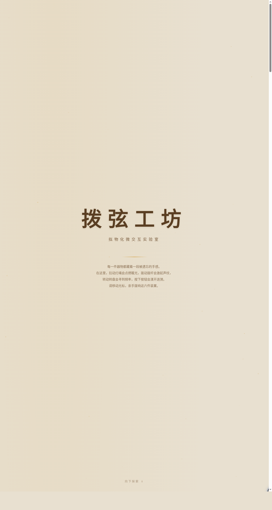

# 拨弦工坊 Boxian Workshop

> 日期：2026-08-17 · 方向：V3 UX 交互设计 · 主题：光标驱动的拟物化微交互实验室

## 简介

「拨弦工坊」是一个拟物化微交互实验室，包含6个独立展区，每个展区是一个有场景叙事的拟物化微交互装置。核心是鼠标光标悬停/移动/点击/拖拽触发的细腻微交互——拉绳吊灯、日月切换、拨杆开关、转盘调谐器、弹簧按钮、磁吸摇杆。所有装置基于物理模型（弹簧Hooke定律/惯性动量/磁性反平方引力/阻尼/摩擦），纯 vanilla HTML/CSS/JS 单文件实现。

## 截图

## 配色方案

- 氧化铜棕 `#7a5c3e` + 深青绿 `#1a4a4a` + 暖象牙 `#e8e0d0` + 琥珀光 `#d4a040`

## 6个展区

1. **拉绳吊灯**——拖拽拉绳点亮灯泡，光线扩散+灯丝呼吸，松手弹性回弹
2. **日月切换滑动开关**——拖动滑块切换昼夜，星空渐变为蓝天白云
3. **拨杆开关**——拖拽拨杆有弹性卡扣感，声波纹扩散+场景切换
4. **转盘调谐器**——旋转转盘调频率，指针弹性跟随+调谐成功指示
5. **弹簧按钮**——按压弹簧压缩（Hooke定律），松手弹回+涟漪扩散
6. **磁吸摇杆**——拖动摇杆松手被磁力拉回中心，磁力线可视化

## 动效亮点

- 自定义光标：白环+琥珀内点+多层发光，三态切换（默认/抓取/点击），开页即显示在屏幕中央
- 拉绳物理摆动（钟摆+弹簧）、灯泡光线扩散、日月渐变过渡
- 拨杆阻尼弹性、转盘旋转惯性、弹簧压缩回弹、磁力线动画
- 粒子光尘、滚动渐入、悬停发光、涟漪点击

## 妙搭在线预览

https://dcniaqwtmoca.feishu.cn/page/L4HpmbkJBdKhYIa50WCclmL6nRh

## 文件说明

| 文件 | 说明 |
|------|------|
| index.html | 完整源码（纯 vanilla HTML/CSS/JS 单文件） |
| 设计规范.md | 色彩系统、字体、展区与交互装置、动效系统设计规范 |
| preview.png | 页面截图（1280×2400） |
| thumbnail.png | 缩略图（1280×720） |
| README.md | 本说明文件 |

## 技术栈

- 纯 vanilla HTML/CSS/JS，无 React/Babel/CDN 依赖
- 字体：Noto Serif SC（标题）+ PingFang SC/Noto Sans SC（正文）+ Courier New（数字）
- 动效：requestAnimationFrame 物理积分器 + Canvas 磁力线 + CSS transitions
