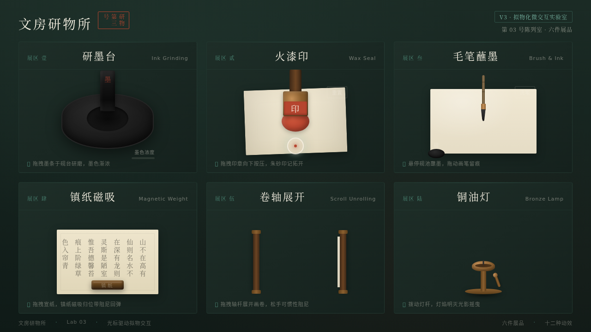

# 文房研物所 Bunbou Lab · 拟物化文房微交互实验室

> 日期：2026-08-17 · 方向：V3 UX 交互设计 · 主题：光标驱动的拟物化文房器物微交互

## 简介

以文房四宝为题的拟物化微交互实验室，六件可把玩装置：研墨台（拖拽墨条研磨出墨）、火漆印（按压盖出朱砂印记）、毛笔蘸墨（拖出枯湿浓淡笔迹）、镇纸磁吸（反平方磁吸 + 阻尼振荡）、卷轴展开（惯性 + 边界弹簧）、铜油灯（拨杆点亮 + 火焰摇曳）。每个展区用鼠标光标悬停/点击/拖拽操作，反馈细腻、有物理质感与场景叙事。深胡桃木 + 黄铜金 + 宣纸白 + 朱砂红的文房气质。

## 截图

## 动效亮点

自定义光标（惯性缓动 + 涟漪）、墨条弹簧回弹、墨色涟漪扩散、火漆压平形变、朱砂印记 bloom、毛笔枯湿浓淡笔迹、镇纸反平方磁吸 + 阻尼振荡、卷轴惯性弹簧、火焰多频率摇曳、光晕阴影联动，共 13 个组件级特效。

## 妙搭在线预览

https://dcniaqwtmoca.feishu.cn/page/ApggmCUFFdPtYAax3Jfct2Fjnbd

## 文件说明

| 文件 | 说明 |
|------|------|
| index.html | 完整源码（纯 vanilla HTML/CSS/JS 单文件） |
| preview.png | 页面截图 |
| 设计规范.md | 色彩/字体/组件/动效/展品规范 |
| thumbnail.png | 平台自动缩略图 |

## 技术栈

纯 HTML + CSS + JavaScript（vanilla 单文件，无 React / 无 Babel / 无外部 CDN），Canvas 笔迹与火焰，RAF 物理积分器，弹簧/磁吸/阻尼模型。
