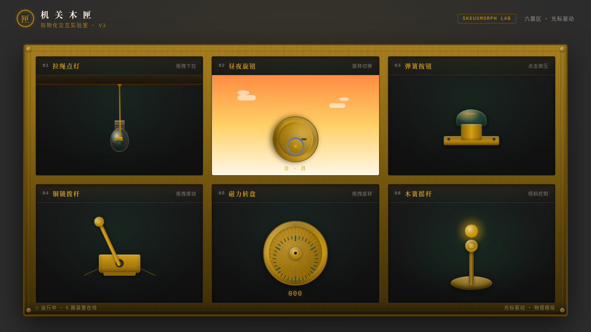

# 机关木匣 Mechanism Box · V3 UX 交互设计

> 日期：2026-08-17 · 方向：V3 UX 交互设计 · 主题：拟物化机械开关交互实验室

## 简介

「机关木匣」是一个以古董木制机关盒为灵感的可把玩交互实验室。打开精美的木匣，里面藏着各种精巧的机械开关和互动装置，每一个都用鼠标光标来操作。6 个展区各自独立、有场景叙事，交互反馈细腻、有物理质感。配色取暖木棕、黄铜金、深森林绿，营造古董木质机关盒质感。

## 截图

## 展区清单

| 编号 | 展区 | 交互方式 | 物理模拟 |
|------|------|----------|----------|
| 01 | 拉绳点灯 | 拖拽下拉 | 弹簧 Hooke 回弹+摆动+点亮/熄灭渐变 |
| 02 | 昼夜旋钮 | 圆周拖拽旋转 | 磁性吸附归位+天空渐变+日月轨道 |
| 03 | 弹簧按钮 | 点击按压 | 弹簧按压回弹+涟漪扩散+地面光晕 |
| 04 | 铜锁拨杆 | 拖拽拨动 | 重力摆动+阻尼回摆+到位咔哒爆发 |
| 05 | 磁力转盘 | 圆周拖拽 | 惯性动量+阻尼减速+12 档磁性吸附 |
| 06 | 木簧摇杆 | 倾斜拖拽 | 弹簧回中+方向映射驱动光球移动 |

## 动效亮点

- 自定义光标（白色粗环+黄铜内点+发光，开页居中显示，悬停三态切换，点击涟漪）
- 每个展区独立的物理模拟（弹簧/惯性/磁性/阻尼/重力）
- 动效周期各不相同，不整齐划一

## 文件说明

| 文件 | 说明 |
|------|------|
| index.html | 完整源码（纯 vanilla HTML/CSS/JS 单文件） |
| preview.png | 页面截图 |
| 设计规范.md | 设计规范文档 |

## 在线预览

[机关木匣 · 妙搭在线预览](https://dcniaqwtmoca.feishu.cn/page/OESSmMTDqddN04ambV5c8aqFnKe)

## 技术栈

纯 vanilla HTML/CSS/JS 单文件，零外部依赖（无 React/无 Babel/无 CDN）
