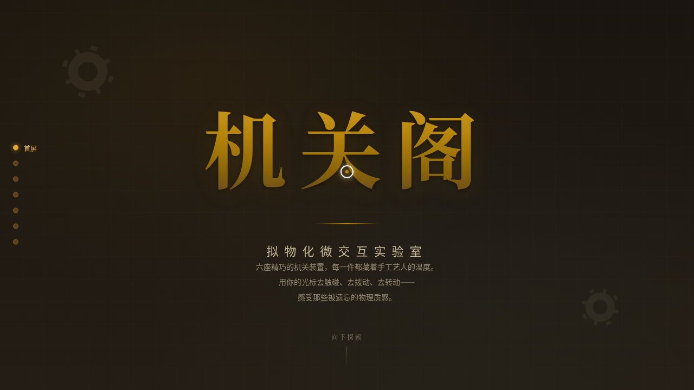

# 机关阁 · 拟物化微交互实验室

> 日期：2026-08-17 · 方向：V3 UX 交互设计 · 主题：拟物化微交互实验室

## 简介

机关阁是一个收藏"机关装置"的交互实验室，以黄铜、铜绿、深胡桃、暖琥珀为主色调，呈现工坊/机械/手工质感。每个展区是一个精致的拟物化微交互装置，以鼠标光标悬停/点击/拖拽为唯一交互方式，所有物理反馈均基于真实物理模型（弹簧 Hooke 定律、惯性动量、磁性反平方引力、阻尼、摩擦）实现。

## 六个展区

1. **拉绳灯**：黄铜拉绳带重力摆动，拖拽点亮灯泡，暖光扩散照亮整面墙
2. **黄铜拨杆**：三只拨杆控制不同氛围，弹簧回弹+咔哒手感
3. **罗盘转盘**：拖拽旋转带惯性阻尼，磁针持续磁性颤动
4. **木盒暗锁**：Hooke 定律弹簧压缩回弹，按压锁扣弹开盒盖
5. **磁力旋钮**：反平方引力模型实现刻度吸附感
6. **抽屉滑轨**：三个抽屉带摩擦阻尼+惯性滑动+限位回弹

## 截图展示

## 妙搭在线预览

https://dcniaqwtmoca.feishu.cn/page/Ag7Omz3B6d3tePa2862cf5H3nof

## 动效亮点

- 拉绳简谐运动+阻尼摆动+弹性拉伸（F = -k·x）
- 灯泡光扩散随距离衰减（I ∝ 1/r²）
- 罗盘惯性旋转（ω(t) = ω₀·e^(-γt)）+磁针双频正弦颤动
- 弹簧压缩回弹（Hooke 定律）
- 磁力吸附（反平方引力 F ∝ 1/r²）
- 抽屉滑轨摩擦阻尼+惯性+限位回弹
- 自定义光标三态切换（默认/悬停/拖拽）+点击涟漪

## 文件说明

| 文件 | 说明 |
|------|------|
| index.html | 完整单文件源码（HTML+CSS+JS） |
| 设计规范.md | 色彩系统、字体、组件规范、动效系统、展区结构 |
| preview.png | 页面截图 |
| thumbnail.png | 缩略图 |
| README.md | 本说明文件 |

## 技术栈

纯 vanilla HTML/CSS/JS 单文件实现，无 React/Babel/外部 CDN 依赖，requestAnimationFrame 物理模拟。
