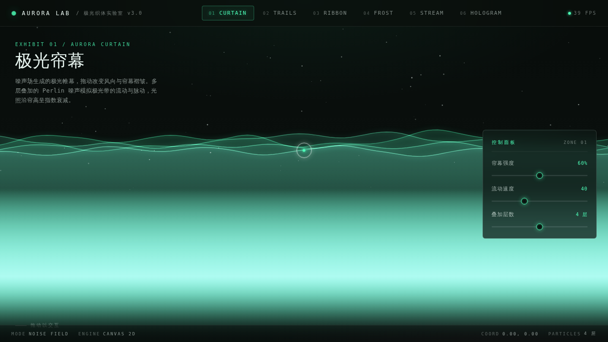

# AURORA 极光织体实验室 · README

> 日期：2026-08-17｜方向：V3 UX 交互设计｜主题：极光/极夜视觉母题炫技特效实验室

## 简介

「AURORA 极光织体实验室」是以极光与极夜为视觉母题的炫技组件特效实验室，纯 vanilla 单文件实现（无 React / 无 Babel / 无外部 CDN）。6 个展区均为 Canvas 2D 实时渲染、鼠标/触控驱动：极光帘幕（噪声场，拖动改风向与褶皱）、星轨拖尾（长曝光，松手消隐）、磁光丝带（Verlet 积分缠绕）、冰晶生长（点击生成分形冰花后融化）、辉光粒子流（3000 粒子流场 + 鼠标斥力漩涡）、全息扫描（扫描线逐行点亮 + 雷达环 + 故障抖动）。极夜墨黑底，极光绿/品红/冰青三色光体。

## 配色

极夜墨黑 `#0A0F0D` · 极光绿 `#4DFFB8` · 品红 `#FF3E8A` · 冰青 `#7FE7E0` · 银白 `#FFFFFF`（详见 设计规范.md）

## 动效亮点

- 极光帘幕多层噪声场，鼠标横拖风向、纵拖褶皱
- 星轨长曝光拖尾（松手缓慢消隐）
- 22 条 Verlet 积分磁光丝带跟随鼠标缠绕
- 分形冰晶点击生长 → 融化
- 3000 粒子流场奔涌 + 鼠标斥力漩涡
- 全息扫描线逐行点亮 + 雷达环 + 故障抖动
- 自定义光标（开页居中、多层发光、hover 变色、点击涟漪）
- 展区切换模糊淡出转场，键盘 1–6 快切

## 文件说明

| 文件 | 说明 |
|---|---|
| index.html | 完整可运行源码（纯 vanilla 单文件，无外部依赖） |
| 设计规范.md | 色彩、展区结构、动效系统、健壮性 |
| preview.png | 页面截图 |
| thumbnail.png | 平台生成缩略图 |

## 在线预览

https://dcniaqwtmoca.feishu.cn/page/LO6umlnqAdB8Z5a4KLzcTlHEnob

## 技术栈

纯 HTML/CSS/JavaScript（Canvas 2D + requestAnimationFrame），无框架无 CDN 依赖。
