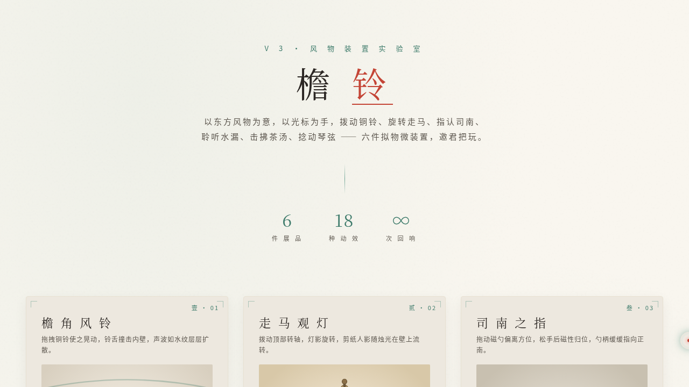

# 檐铃·风物装置实验室

> 日期：2026-08-17 · 方向：V3 UX 交互设计 · 主题：东方风物拟物化微交互装置实验室

## 简介

一座可把玩的风物微交互实验室，六件展品均为东方风物意象的拟物化微交互装置：檐角风铃、走马观灯、司南之指、铜漏滴水、茶筅击拂、素弦余韵。每个展区须用鼠标光标上手操作（悬停/点击/拖拽），交互反馈细腻、有物理质感与场景叙事。

## 截图

## 动效亮点

- 自定义光标（白环 + 朱砂内点 + 发光 + 三态切换 + 点击涟漪，开页居中）
- 钟摆物理（风铃摆动 + 撞击声波）
- 胡克定律弹簧归位（司南磁勺）
- 重力下落 + 水面涟漪（铜漏滴水）
- 惯性衰减 + 泡沫生成（茶筅击拂）
- 正弦振动衰减 + 余韵波纹（素弦）
- 共 18+ 个组件级动效

## 妙搭在线预览

https://dcniaqwtmoca.feishu.cn/page/KdpUmff4Bd9AhYaBFBJc94rrnvf

## 文件说明

| 文件 | 说明 |
|------|------|
| index.html | 完整可运行源码（纯 vanilla，内联 CSS + JS） |
| thumbnail.png | 页面截图 |
| 设计规范.md | 色彩/字体/展品/动效规范 |

## 技术栈

纯 vanilla HTML/CSS/JS 单文件，无 React / 无 Babel / 无外部 CDN 依赖。

## 配色

青瓷绿 #6BA292 · 铜锈青 #3E7B6B · 月白 #EDE8DF · 朱砂 #C44536
