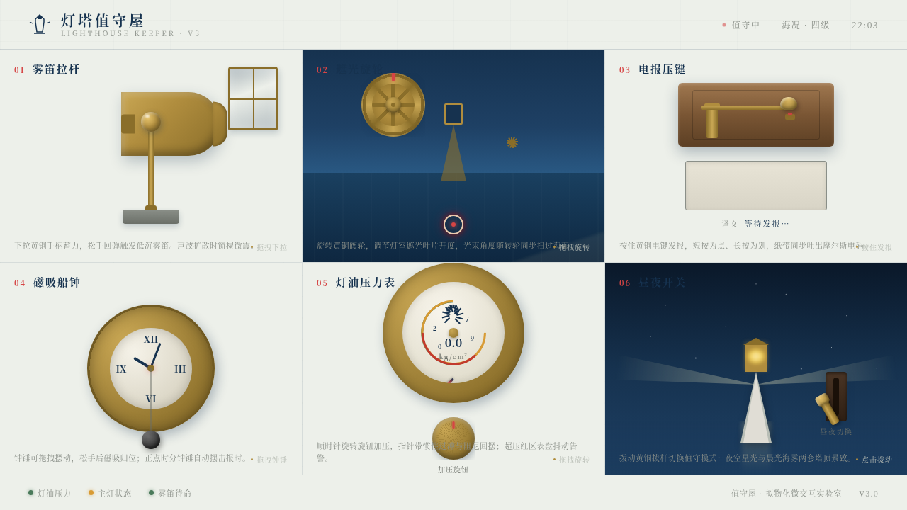

# 灯塔值守屋 Lighthouse Keeper

> 日期：2026-08-17 · 方向：V3 UX 交互设计 · 主题：深夜灯塔看守人控制台·光标驱动拟物化微交互实验室

## 简介

一座深夜灯塔的看守人控制台。6 个展区各是一个独立的拟物化微交互装置——雾笛拉杆、遮光旋轮、电报压键、磁吸船钟、灯油压力表、昼夜开关。全部用鼠标光标悬停/点击/拖拽操作，反馈细腻、有物理质感与场景叙事。海雾白底配信号红与黄铜，深海军蓝承载夜色。

## 截图

## 动效亮点

- 雾笛拉杆：Hooke 弹簧回弹 + 三道声波扩散 + 玻璃窗震动
- 遮光旋轮：黄铜阀轮惯性旋转，光束角度跟手扫海
- 电报压键：短按点/长按划，纸带吐摩尔斯码并实时译码
- 磁吸船钟：钟锤磁吸归位 + 重力阻尼，整点自摆报时
- 灯油压力表：指针弹簧-阻尼过冲，超压红区表盘抖动告警
- 昼夜开关：拨杆切换夜空星光 ↔ 晨光海雾，光束倒影联动
- 自定义光标（三态 + 涟漪 + 阻尼跟随，开页居中显示）

## 文件说明

| 文件 | 说明 |
|---|---|
| index.html | 完整可运行源码（纯 vanilla HTML/CSS/JS 单文件，无外部依赖） |
| preview.png | 页面截图 |
| 设计规范.md | 色彩 / 字体 / 展区 / 动效 / 健壮性规范 |

## 在线预览

[灯塔值守屋 · 妙搭在线预览](https://dcniaqwtmoca.feishu.cn/page/P3T6mI3zKdabBgaTeYjcP83WnHh)

## 技术栈

纯 vanilla HTML/CSS/JS 单文件，无 React / 无 Babel / 无 CDN 依赖。
