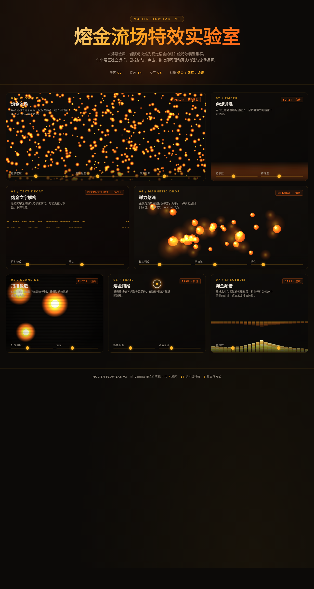

# 熔金流场 · V3 UX 交互设计

> 日期：2026-08-17 · 方向：V3 UX 交互设计 · 主题：熔金流场特效实验室（炫技组件特效动画实验室）

## 简介

一个以"熔融金属 / 岩浆 / 火焰"为视觉语言的炫技组件特效动画实验室。7 个展区，每个展区是一个独立的、视觉冲击力强的组件级特效装置，全部可亲手把玩——鼠标驱动热源、点击引爆余烬、悬停触发文字熔化解构、拖拽磁力熔滴、鼠标移动生成惯性拖尾。黑曜石黑底配熔金主亮色与铜红余烬橙渐变，营造熔炉深处的灼热感。

## 截图

## 动效亮点

14 个组件级特效，共享单 RAF 循环：Perlin 噪波流场+热力扭曲、粒子爆发浮力阻尼、像素级文字解构熔滴下坠、反平方引力 metaball 熔合桥接、CRT 扫描线色差偏移、惯性拖尾重力滴落、频谱光柱包络倒影。每个展区配 2-3 个参数滑杆实时调节。自定义光标白环+熔金内点+多层发光，悬停放大，点击涟漪。动效基于弹簧阻尼、反平方引力、浮力阻尼、惯性动量等物理模型。

## 妙搭在线预览

https://dcniaqwtmoca.feishu.cn/page/FRAYmDLR6d5cz5aCsQMcp2rnnyh

## 文件说明

| 文件 | 说明 |
|------|------|
| index.html | 完整可运行源码（纯 vanilla 单文件，内联 CSS/JS） |
| preview.png | 页面截图（1280×2400） |
| thumbnail.png | 平台缩略图 |
| 设计规范.md | 色彩/字体/展区/动效/健壮性规范 |
| README.md | 本说明文件 |

## 技术栈

纯 HTML / CSS / JavaScript（vanilla，无 React / 无 Babel / 无外部 CDN 依赖），单文件 index.html。
