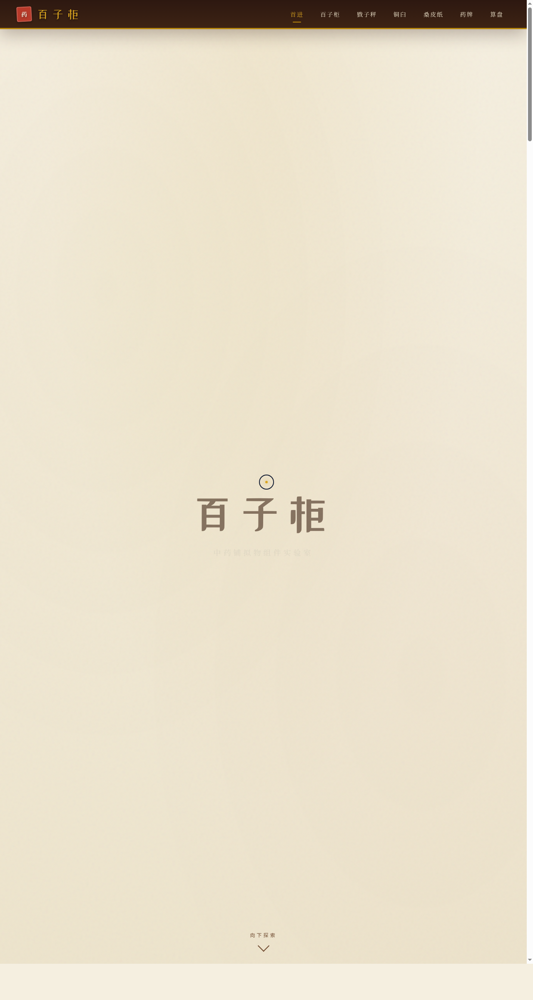

# 百子柜 · 中药铺拟物组件实验室

> 日期：2026-08-17 · 方向：V3 UX 交互设计 · 主题：老中药铺拟物化微交互装置

## 简介

一间老中药铺里的拟物化微交互装置实验室，六个展区全部由鼠标光标上手操作（悬停 / 点击 / 拖拽）：百子柜抽屉弹簧回弹、戥子秤力矩平衡、铜臼捣药药尘飞溅、桑皮纸包 3D 折纸盖印、药牌挂牌翻转摇摆、掌柜算盘拨珠。每个展区有场景叙事与物理质感。紫檀木棕 + 宣纸米白 + 铜器暗金 + 朱砂印泥的老药铺配色。

## 截图

## 动效亮点

自定义光标（铜芯 + 发光 + 三态 + 涟漪）、抽屉 Hooke 弹簧回弹、秤杆力矩物理、捣药药尘粒子、纸包 3D 翻折盖朱砂印、木牌翻转 + 挂绳阻尼摇摆、算盘拨珠碰撞，共 12+ 组件级特效，全部基于物理模型。

## 妙搭在线预览

https://dcniaqwtmoca.feishu.cn/page/EKdZmiL8SdY8iRaYbHmcHMoAnKd

## 文件说明

| 文件 | 说明 |
|---|---|
| index.html | 完整可运行源码（纯 vanilla HTML/CSS/JS 单文件） |
| preview.png | 页面截图 |
| 设计规范.md | 色彩 / 字体 / 展区 / 动效规范 |
| thumbnail.png | 平台自带缩略图 |

## 技术栈

纯原生 HTML + CSS + JavaScript（无 React / 无 Babel / 无外部 CDN），单文件内联实现。
