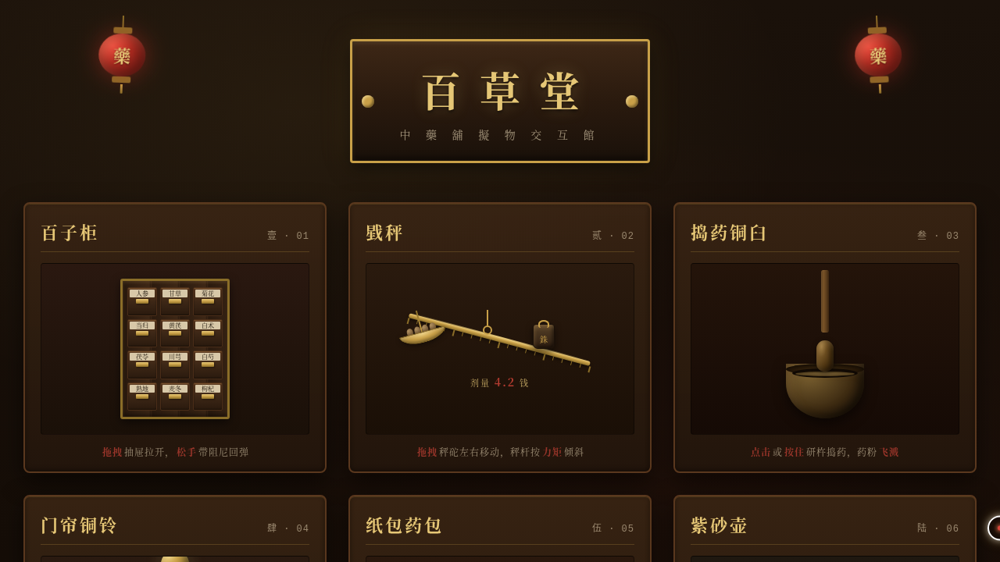

# 百草堂 · 中药铺拟物交互馆

> V3 UX 交互设计 · 2026-08-17 · 光标驱动的拟物化小组件实验室

## 主题

一间老式中药铺里的拟物化微交互装置馆：百子柜、戥秤、捣药铜臼、门帘铜铃、纸包药包、紫砂壶——每个展区都要用鼠标光标上手操作（悬停 / 点击 / 拖拽）才有意义。

## 设计说明

玄黑深漆木 + 朱砂红 + 宣纸米 + 黄铜金的东方药铺色系；楷体匾额、宋体签条，红灯笼摇曳开场，场景叙事完整。

## 动效亮点

- 百子柜抽屉：拖拽拉出、松手弹簧阻尼回弹
- 戥秤：拖拽秤砣，秤杆按力矩平衡实时倾斜
- 捣药铜臼：研杵下落反弹 + 药粉粒子飞溅
- 门帘铜铃：拨动后阻尼摆动 + 三层声纹光晕扩散
- 纸包药包：四翼依次折叠、红绳显现
- 紫砂壶：悬停蒸汽升腾（粒子实时模拟）
- 自定义光标：白环 + 朱砂内点 + 黄铜发光，三态切换，开页即居中

## 在线预览

https://dcniaqwtmoca.feishu.cn/page/DujDmE8ahdGnQuaTscLcY0QKnYf

## 文件说明

| 文件 | 说明 |
|---|---|
| index.html | 完整可运行源码（纯 vanilla 单文件，零外部依赖），浏览器直接打开可预览 |
| 设计规范.md | 色彩 / 字体 / 展区结构 / 动效系统 |
| thumbnail.png | 页面真实截图 |

## 技术栈

纯 vanilla HTML / CSS / JS，统一 RAF 调度器，无 React / 无 Babel / 无 CDN
