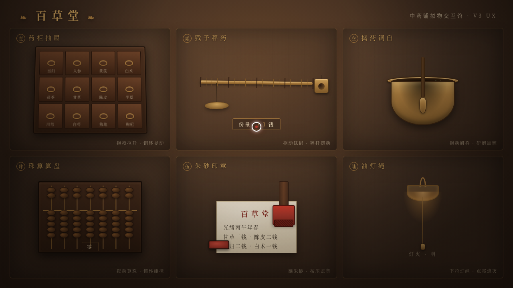

# 百草堂 · 中药铺拟物交互馆 · UX 交互设计

> 日期：2026-08-17 · 方向：V3 UX 交互设计 · 主题：中药铺拟物化小组件交互实验室

## 简介

「百草堂」是一间老式中药铺场景里的拟物化微交互装置实验室，共六个展区：药柜抽屉（拖拽拉开、铜环晃动、弹簧阻尼滑轨）、戥子秤药（拖拽铜砝码、秤杆力矩倾斜阻尼回稳、读数）、捣药铜臼（拖拽研杵画圈研磨、药材颗粒飞溅）、珠算算盘（拨动算珠惯性碰撞、弹簧吸附落位）、朱砂印章（蘸砚台再按压、按压力度决定浓淡、印泥晕开）、油灯拉绳（下拉点亮 / 熄灭、灯绳单摆、全局灯光明灭与阴影扩散）。每个展区必须用鼠标光标上手操作才有意义，交互反馈细腻、有物理质感与场景叙事。

## 动效亮点

- 药柜抽屉弹簧阻尼滑轨 + 铜环单摆晃动
- 戥子秤杆力矩物理倾斜 + 阻尼回稳
- 捣药研杵绕臼底旋转 + 药材重力粒子飞溅
- 算珠惯性碰撞 + 弹簧吸附落位
- 印章蘸墨检测 + 朱砂印泥晕开（按压力度决定浓淡）
- 油灯灯绳单摆 + 全局灯光明灭与阴影扩散
- 自定义光标：白环 + 朱砂内点，悬停放大，拖拽变抓手，点击涟漪，开页居中

## 妙搭在线预览

https://dcniaqwtmoca.feishu.cn/page/CjkZmztqadGkAHanqj9crEl6ntf

## 文件说明

| 文件 | 说明 |
|---|---|
| index.html | 完整可运行源码（纯 vanilla 单文件，内联 CSS/JS） |
| thumbnail.png | 页面截图 |
| 设计规范.md | 色彩 / 字体 / 展区 / 动效规范 |

## 技术栈

纯 vanilla HTML/CSS/JS 单文件，无 React / 无 Babel / 无外部 CDN 依赖。统一 RAF 管理器，支持 prefers-reduced-motion 降级。
