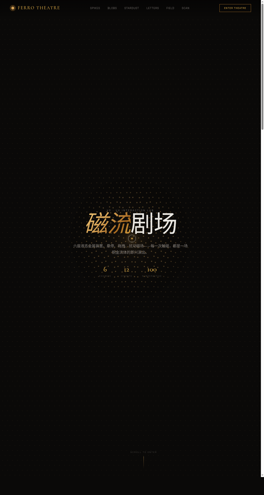

# 磁流剧场 Ferro Theatre

> 日期：2026-08-17　方向：V3 UX 交互设计

以铁磁流体为灵感母题的炫技组件特效实验室——6 个独立可亲手把玩的组件级特效装置：铁磁流体尖峰、液态金属 Blob、铜金星尘、金属文字解构、磁场线可视化、全息扫描滤镜。纯 vanilla 单文件实现，无 React / Babel / CDN 依赖。

## 截图

## 动效亮点

自定义光标、点击涟漪、Hero 点场尖峰、弹簧入场、数字计数、滚动渐入、磁力按钮、悬停发光、光泽扫过、粒子拖尾、Metaball 融合、CRT 扫描线、向量场流线。每个展区必须上手操作才有意义。

## 妙搭在线预览

https://dcniaqwtmoca.feishu.cn/page/NHmSm2lFddK2cfaSGzlcz3SynUf

## 文件说明

| 文件 | 说明 |
|------|------|
| index.html | 完整单页源码（纯 vanilla，CSS/JS 全内联） |
| 设计规范.md | 色彩 / 字体 / 圆角 / 展区 / 动效规范 |
| preview.png | 页面截图 |
| README.md | 本说明 |

## 技术栈

纯 vanilla HTML/CSS/JS 单文件（无 React / Babel / 外部 CDN）；Canvas + metaball 等值面；统一 RAF 管理器 + visibilitychange 暂停；高频鼠标事件直操作 DOM；支持 prefers-reduced-motion。
