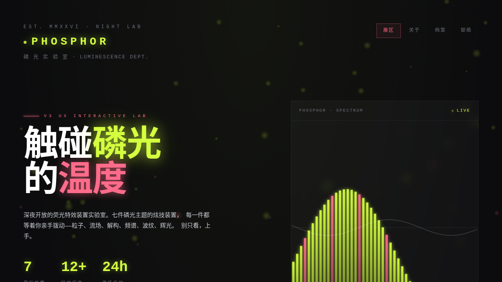

# PHOSPHOR 磷光实验室

> 日期：2026-08-17　方向：V3 UX 交互设计

## 简介

「PHOSPHOR 磷光实验室」——一座深夜开放的荧光特效装置实验室。7 件互动装置均为纯视觉炫技的组件级特效（磷光拖尾、粒子星尘、磁力文字解构、频谱辉光柱、CRT 扫描线滤镜、余晖涟漪、流体辉光），每件上手操作才有意义。不做物理公式演示，只做越炫越好的组件特效动画。

## 设计说明

- 配色：玄黑 `#0C0C0E` + 磷光黄绿 `#D4FF3F` + 珊瑚粉 `#FF6B8A` + 银灰 `#C9CCD3`，暗色荧光实验室质感
- 纯 vanilla HTML/CSS/JS 单文件实现，无 React / Babel / CDN 依赖，一次成功无白屏
- 详见 [`设计规范.md`](./设计规范.md)

## 动效亮点

自定义光标（三环发光 + 点击涟漪）、7 件可把玩装置（反平方斥力粒子 / 磁力文字形变 / 4 模式频谱 / 双滑块 CRT / 阻尼涟漪 / 噪波流体）、hero 频谱可视化、3D 卡片倾斜、视差大字等 12+ 组件级特效，全部基于物理模型（弹簧/反平方/阻尼/噪波流场）。

## 截图

## 妙搭在线预览

https://dcniaqwtmoca.feishu.cn/page/V3esm4dJPdd6rhaggeCcG7n3n9e

## 文件说明

| 文件 | 说明 |
|---|---|
| index.html | 完整可运行源码（纯 vanilla 单文件，内联 CSS/JS） |
| thumbnail.png | 页面截图 |
| 设计规范.md | 色彩/字体/装置/动效/健壮性规范 |
| README.md | 本说明 |

## 技术栈

纯 vanilla HTML/CSS/JS（无框架、无构建、无外部依赖）
