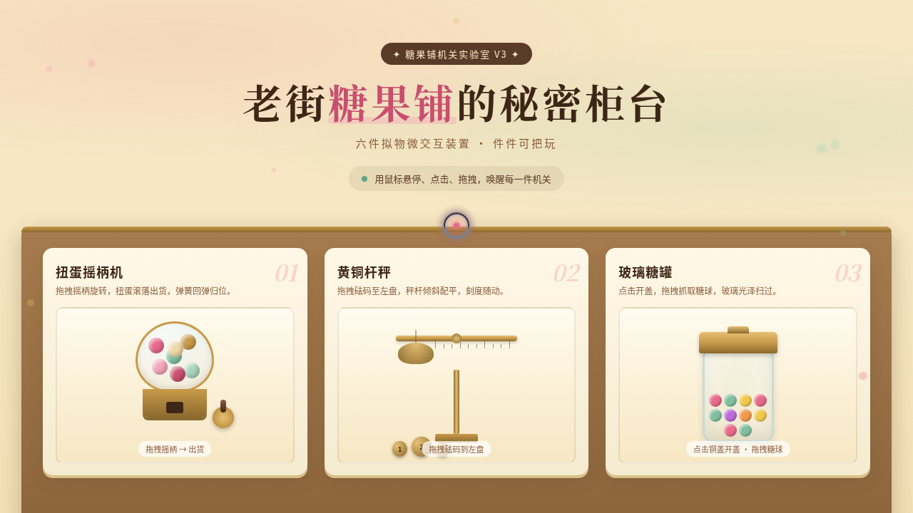

# 糖果铺机关柜台 Candy Counter · UX 交互设计

> 日期：2026-08-17 · 方向：V3 UX 交互设计 · 主题：糖果铺拟物化小组件动画实验室

## 简介

「糖果铺机关柜台」是一家老街糖果铺的柜台即实验室，共 6 件拟物化微交互装置，全部用鼠标悬停 / 点击 / 拖拽操作：扭蛋摇柄机、黄铜杆秤、玻璃糖罐、唤人铜铃、拉糖机滚筒、老式收银机。每件装置有场景叙事与物理质感反馈。奶油黄 + 草莓粉 + 薄荷绿 + 巧克力棕的糖果暖色调。

## 动效亮点

- 自定义光标：三色三层，开页居中，悬停/抓取/点击三态切换
- 弹簧回弹（Hooke 定律）：扭蛋摇柄、糖球罐内回弹、拉糖机手柄
- 惯性旋转 + 阻尼摩擦：摇柄、滚筒
- 重力下落 + 弹跳：糖球抛出
- 多层声波涟漪 + 星光粒子：铜铃
- 光泽扫过、3D 倾斜、滚动渐入、数字计数、浮动糖果装饰

## 文件说明

| 文件 | 说明 |
|------|------|
| index.html | 纯 vanilla 单文件源码（HTML + CSS + JS） |
| thumbnail.png | 页面截图 |
| 设计规范.md | 色彩 / 字体 / 展区 / 动效规范 |

## 妙搭在线预览

https://dcniaqwtmoca.feishu.cn/page/Cj5hmTZKZdpPRPa2ksecdPornqd

## 技术栈

纯 vanilla HTML/CSS/JS 单文件实现，零外部依赖（无 React / 无 Babel / 无 CDN）。
