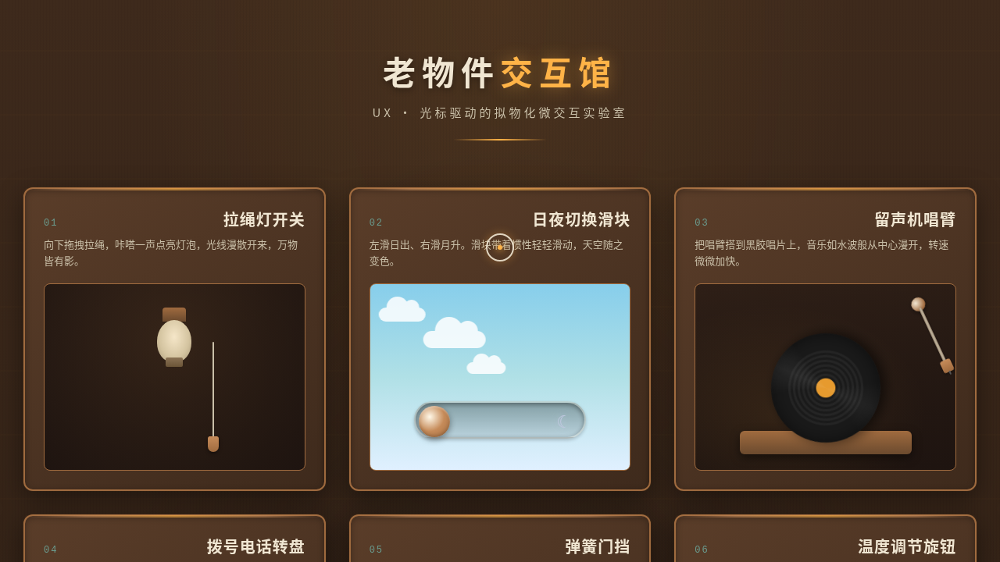

# 老物件交互馆 Vintage Interaction Gallery

**日期**：2026-08-17
**方向**：V3 UX 交互设计
**主题**：老物件交互馆 —— 把日常老物件的物理交互手感做成可上手操作的网页展品

## 简介

一个以「光标驱动的拟物化小组件动画」为展品的可把玩实验室，包含 6 个独立展区，每个展区是一个有场景叙事的拟物化微交互装置。所有交互通过鼠标光标操作（悬停/点击/拖拽），交互反馈细腻、有物理质感。采用深胡桃木 + 暖焦糖 + 琥珀光 + 奶油米的复古配色。

## 截图

## 展区

1. **拉绳灯开关** — 拖拽弹簧绳点亮灯泡 + 光线扩散 + 阴影变化
2. **日夜切换滑块** — 拖动滑块切换昼夜 + 天空渐变 + 星空云朵
3. **留声机唱臂** — 拖唱臂放到唱片 + 音波扩散 + 转速变化
4. **拨号电话转盘** — 旋转拨号 + 惯性回弹 + 棘轮震动
5. **弹簧门挡** — 推弯弹簧 + 阻尼振荡 + 摆幅衰减
6. **温度调节旋钮** — 旋转旋钮 + 棘轮吸附 + 刻度点亮 + 背景渐变

## 动效亮点

- 自定义光标：白环 + 琥珀内点 + 多层发光，三态切换（默认/hover/拖拽）
- 12+ 组件级特效：光线扩散、惯性滑动、棘轮吸附、弹簧弯曲、阻尼振荡、弹性回弹、震动反馈、音波波纹、星星闪烁、云朵飘动、渐变过渡、点击涟漪
- 每个展区有独立的物理模型（弹簧/惯性/阻尼/棘轮）

## 文件说明

| 文件 | 说明 |
|------|------|
| index.html | 完整可运行的源码（纯 vanilla HTML/CSS/JS 单文件） |
| preview.png | 页面截图 |
| 设计规范.md | 设计规范文档 |

## 在线预览

[老物件交互馆](https://dcniaqwtmoca.feishu.cn/page/IUAEmcWnXd7OkJauNv8c4XYCnc3)

## 技术栈

- 纯 vanilla HTML / CSS / JavaScript（无 React / 无 Babel / 无外部 CDN 依赖）
- Canvas / SVG 物理动画
- requestAnimationFrame 物理积分器
- CSS Animation / Transition
