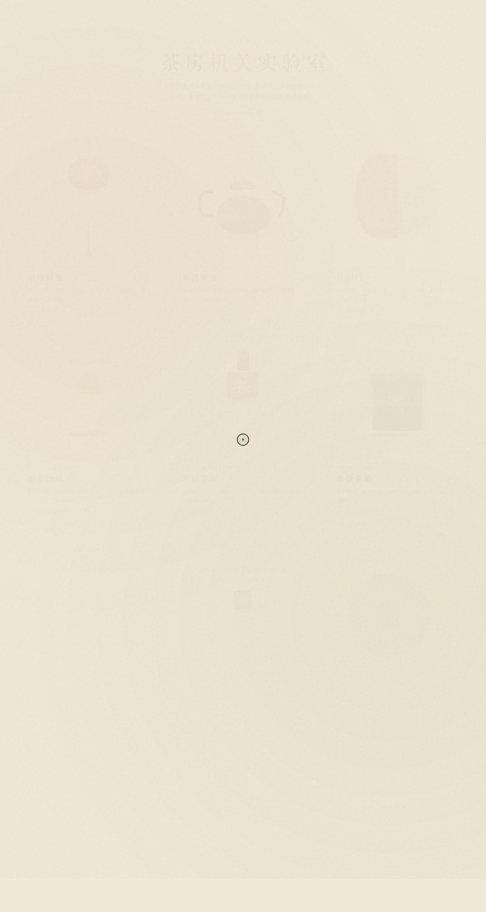

# 老茶馆机关 Teahouse Mechanisms Lab

> 日期：2026-08-17 · 方向：V3 UX 交互设计 · 主题：茶馆主题拟物化机械微交互实验室

## 简介

「老茶馆机关」是一个以中国传统茶馆为场景叙事的拟物化微交互实验室。六个展区各为一件独立的、可用鼠标光标操作的机械装置——吊绳灯笼、紫砂倾茶、月洞门、铜架沙漏、朱砂茶印、紫砂茶罐。每个装置都有物理质感的反馈：弹簧回弹、阻尼、磁性吸附、粒子爆发，交互细腻、有场景感。

## 截图

## 动效亮点

- 自定义光标 — 三态切换（默认/悬停/拖拽），开页即显示在屏幕中央，点击有涟漪
- 吊绳灯笼 — 拖拽拉绳点亮灯笼，弹簧回弹+钟摆摆动+光晕扩散
- 紫砂倾茶 — 拖拽壶把倾倒茶水，阻尼弹簧回正+茶水流过阈值+蒸汽粒子上升
- 月洞门 — 滑动红色门扇，磁性吸附+昼夜切换+星空闪烁+日月交叉淡入
- 铜架沙漏 — 翻转沙漏，180°缓动+RAF 沙粒流动 4 秒
- 朱砂茶印 — 拖拽印章按压，回弹+墨迹溅射涟漪+字印缩放冲击
- 紫砂茶罐 — 拖拽罐盖，提升旋转+茶叶粒子爆发+加速下落微弹

## 展区列表

| 编号 | 名称 | 交互 | 物理模型 |
|------|------|------|----------|
| 01 | 吊绳灯笼 | 拖拽拉绳 | 弹簧+钟摆+光晕 |
| 02 | 紫砂倾茶 | 拖拽壶把 | 阻尼弹簧+茶水+蒸汽 |
| 03 | 月洞门 | 滑动门扇 | 磁性吸附+昼夜切换 |
| 04 | 铜架沙漏 | 翻转 | 缓动+沙粒流动 |
| 05 | 朱砂茶印 | 拖拽按压 | 回弹+墨迹涟漪 |
| 06 | 紫砂茶罐 | 拖拽罐盖 | 旋转+粒子爆发 |

## 文件说明

| 文件 | 说明 |
|------|------|
| index.html | 完整可运行的源代码（纯 vanilla HTML/CSS/JS 单文件） |
| preview.png | 页面截图 |
| 设计规范.md | 设计规范文档 |
| README.md | 本文件 |

## 在线预览

[老茶馆机关](https://dcniaqwtmoca.feishu.cn/page/QzLdm6Cv5dY5zAa6SC6cT5n6nGf)

## 技术栈

纯 vanilla HTML/CSS/JS 单文件实现，无 React / 无 Babel / 无外部 CDN 依赖。所有 RAF 循环随 visibilitychange 暂停，mousemove 直接操作 DOM transform，prefers-reduced-motion 降级为静态。
