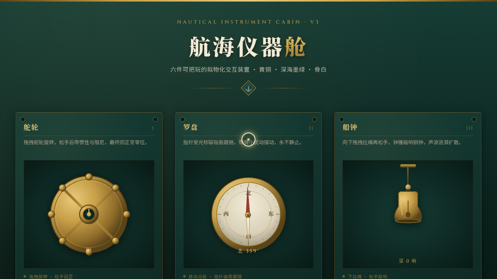

# 航海仪器舱

> 日期：2026-08-17 · 方向：V3 UX 交互设计 · 主题：光标驱动的拟物化航海仪器小组件实验室

## 简介

以航海仪器为场景的拟物化小组件实验室，6 件可用鼠标上手把玩的微交互装置：舵轮、罗盘、船钟、舷窗、六分仪、气压计。每个展区都有场景叙事与物理质感的交互反馈。黄铜金 + 深海墨绿 + 骨白配色。

## 截图

## 动效亮点

- 舵轮拖拽旋转 + 松手弹簧阻尼回正（Hooke 定律）
- 罗盘指针磁吸跟随光标 + 微扰动永不静止
- 船钟拉绳下拉敲响 + 钟锤摆动 + 声波涟漪扩散
- 舷窗铜制滑块拖动切换昼夜，海景天色与星云雾随之变化
- 六分仪拖拽活动臂，每度刻度咬合齿感反馈
- 气压计点击给脉冲，指针阻尼振荡 + 天气文字联动
- 自定义光标开页即居中（白环 + 金点 + 多层发光），悬停/拖拽三态切换

## 在线预览

https://dcniaqwtmoca.feishu.cn/page/D2c3mVQiSdT820apNogcPHLinX0

## 文件说明

| 文件 | 说明 |
|------|------|
| index.html | 完整可运行源码（纯 vanilla HTML/CSS/JS 单文件） |
| preview.png | 页面截图 |
| 设计规范.md | 色彩系统、字体、展区、动效规范 |

## 技术栈

纯 vanilla HTML/CSS/JavaScript 单文件，无 React / 无 Babel / 无外部 CDN 依赖。
