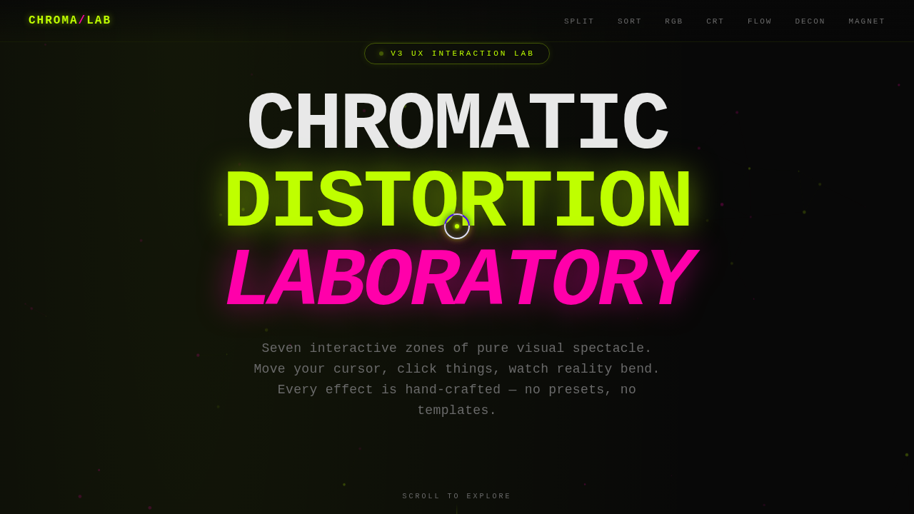

# Chromatic Distortion Lab · 色散畸变特效实验室

> 日期：2026-08-17 · 方向：V3 UX 交互设计 · 主题：色散畸变视觉特效

## 简介

「Chromatic Distortion Lab」是一个以色散、故障、畸变为主题的视觉特效实验室，包含 7 个独立可亲手操作的展区。每个展区是一个独立的组件级特效装置，从 RGB 通道分离到 Perlin 噪声流场，从 CRT 扫描线到磁力形变，越炫越好。纯 vanilla HTML/CSS/JS 单文件实现，无任何外部依赖。

## 截图

## 配色

酸绿 `#bfff00` + 虚空黑 `#080808` + 电光品红 `#ff00aa`

## 展区列表

1. **Chromatic Split** — 鼠标推动 RGB 通道分离
2. **Pixel Sort Glitch** — 拖拽生成像素排序故障条纹
3. **RGB Channel Drift** — SVG 三通道分别漂移
4. **CRT Scanline Filter** — 扫描线 + 暗角 + 噪点 + 刷新率
5. **Noise Flow Field** — 800+ 粒子 Perlin 噪声流场
6. **Text Deconstruction** — 逐字 3D 悬停解构
7. **Magnetic Warp** — 网格点阵磁力场吸引/排斥

## 动效亮点

- 自定义光标（白环 + 酸绿内点 + 品红辉光 + 涟漪）
- 光标拖尾粒子
- 标题 glitch 色散抖动
- Hero 背景粒子连线网络
- Perlin 噪声流场粒子运动
- 像素排序 Canvas 故障效果
- CRT 扫描线曲率渲染
- 磁力形变弹簧物理

## 文件说明

| 文件 | 说明 |
|------|------|
| `index.html` | 完整单文件源码（纯 vanilla HTML/CSS/JS） |
| `设计规范.md` | 色彩系统、字体、组件、动效规范 |
| `thumbnail.png` | 页面预览截图 |
| `package.json` | 项目元数据 |

## 在线预览

[Chromatic Distortion Lab · 妙搭在线预览](https://dcniaqwtmoca.feishu.cn/page/BDhXmHVm9dmv3zayKvDc11qnnob)

## 技术栈

纯 vanilla HTML/CSS/JS 单文件，无 React/Babel/CDN 依赖。Canvas 2D API + SVG + requestAnimationFrame 统一管理 / visibilitychange 暂停 / beforeunload 清理 / prefers-reduced-motion 全量降级。
