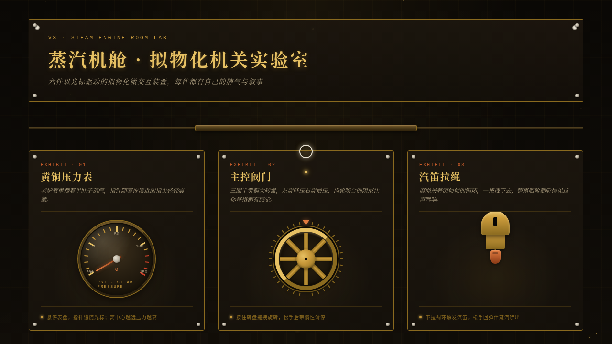

# 蒸汽机舱 · 拟物化机关实验室

> 日期：2026-08-17 · 方向：V3 UX 交互设计 · 主题：蒸汽朋克机舱拟物化微交互装置陈列

## 简介

一个以「光标驱动的拟物化小组件动画」为展品的可把玩实验室，蒸汽朋克机舱场景。6 件展区装置：黄铜压力表、主控阀门、汽笛拉绳、往复活塞泵、黄铜拉杆、锅炉火舱门，均需鼠标悬停 / 点击 / 拖拽才有意义，反馈细腻、有物理质感与场景叙事。炭黑 + 黄铜金 + 铁锈橙 + 铆钉银白配色。

## 截图

## 动效亮点

- 自定义光标：内环弹簧缓动 + 光晕慢跟 + 三态切换（默认/悬停/抓取）+ 点击涟漪，开页居中
- 主控阀门：角度积分 + 惯性衰减滑停
- 汽笛拉绳：Hooke 弹簧回弹 + 蒸汽粒子 + 声浪均衡条
- 活塞泵：弹簧劲度随压缩递增 + 压力计联动
- 锅炉舱门：3D 翻门 + 火焰摇曳 + 热浪扭曲
- 环境金尘飘浮、铆钉金属高光、刻度红区警示等共 15+ 组件级特效

## 妙搭在线预览

https://dcniaqwtmoca.feishu.cn/page/PnwamzjGhdrWilaGzFYcSsTTnif

## 文件说明

| 文件 | 说明 |
|---|---|
| index.html | 完整可运行纯 vanilla 单文件源码 |
| 设计规范.md | 色彩系统、字体、展区装置、动效、健壮性 |
| thumbnail.png | 页面截图 |
| README.md | 本说明文件 |

## 技术栈

纯 HTML/CSS/JavaScript 单文件，无 React / 无 Babel / 无外部 CDN 依赖，requestAnimationFrame + 物理积分器驱动。
