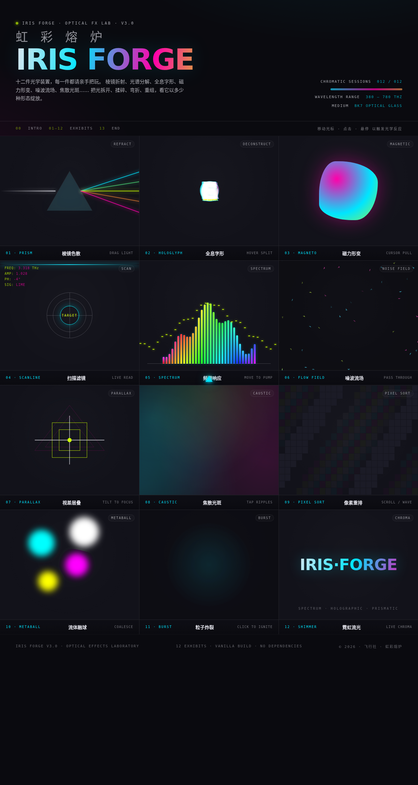

# 虹彩熔炉 Iris Forge · 光学炫技特效实验室

> 日期：2026-08-17 · 方向：V3 UX 交互设计 · 主题：光学炫技特效实验室

## 简介

虹彩熔炉是一个以光学炫技组件特效为展品的可亲手把玩实验室。包含 12 件可交互光学装置：棱镜色散、全息字形、磁力形变、扫描滤镜、频谱响应、噪波流场、视差层叠、焦散光斑、像素重排、流体融球、粒子炸裂、霓虹流光。配色取自暗房光学实验——曜石黑背景 + 棱镜青/品红/电光酸橙高饱和霓虹色。

## 截图展示

## 动效亮点

- 棱镜色散：拖动光线角度，光谱 5 色分离
- 全息字形：RGB 三色通道错位解构
- 磁力形变：8 控制点 blob 有机形变 + 空闲呼吸
- 频谱响应：32 根频谱条，光标驱动共振峰
- 噪波流场：粒子沿正弦噪声场流动
- 焦散光斑：双层伪焦散 + 点击涟漪
- 流体融球：CSS 对比度滤镜 metaball
- 粒子炸裂：80+ 彩色粒子 + 冲击波环
- 自定义棱镜光标：居中启动 + 4 粒子拖尾

## 妙搭在线预览

https://dcniaqwtmoca.feishu.cn/page/RS5CmwxsfdAO3MaJJWtcaVkrnoc

## 文件说明

| 文件 | 说明 |
|------|------|
| index.html | 完整源代码（纯 vanilla HTML/CSS/JS 单文件） |
| preview.png | 页面截图 |
| 设计规范.md | 设计规范文档 |

## 技术栈

纯 vanilla HTML/CSS/JS 单文件实现，零外部依赖（无 React/Babel/CDN）。
