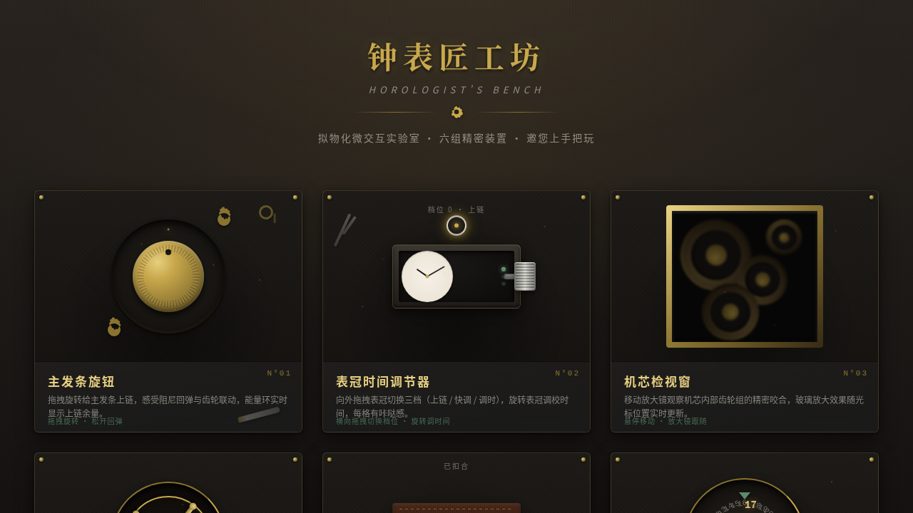

# 钟表匠工坊 Horologist's Bench · UX 交互设计

> 日期：2026-08-17 · 方向：V3 UX 交互设计 · 主题：钟表零件拟物化微交互实验室

## 简介

一个以钟表匠工作台为场景的拟物化微交互实验室，6 个展区各为一个独立的、有场景叙事的拟物化微交互装置。鼠标光标悬停 / 拖拽 / 点击触发细腻物理反馈：发条旋钮上链回弹、表冠三档调节、机芯放大镜检视、陀飞轮悬停加速、表带扣开合金属反光、日历拨盘惯性滚动磁性吸附。炭灰黑 + 黄铜金 + 古银 + 铜锈绿的钟表工坊配色。

## 截图

## 动效亮点

- 主发条旋钮：拖拽旋转上链 + 弹簧胡克定律回弹 + 齿轮联动 + 能量环
- 表冠调节器：三档拉出 + 旋转调时间 + 咔哒缩放反馈
- 机芯检视窗：放大镜跟随光标 + SVG 齿轮组动态咬合
- 陀飞轮装置：悬停加速 + 离开后惯性阻尼减速
- 表带扣开关：点击/拖拽开合 + 金属高光亮闪
- 日历拨盘：惯性滚动 + 磁性吸附归位 + 黄铜日期显示

## 展区列表

1. 主发条旋钮 — 拖拽上链，弹簧回弹，齿轮联动
2. 表冠时间调节器 — 三档拉出，旋转调时，咔哒反馈
3. 机芯检视窗 — 放大镜跟随，齿轮组 SVG 动态渲染
4. 陀飞轮悬停装置 — 悬停加速，惯性减速
5. 表带扣开关 — 拖拽开合，金属反光
6. 日历快调拨盘 — 惯性滚动，磁性吸附

## 文件说明

| 文件 | 说明 |
|------|------|
| `index.html` | 完整源码（纯 vanilla HTML/CSS/JS 单文件） |
| `设计规范.md` | 色彩系统、字体、展区结构、动效、物理模型规范 |
| `preview.png` | 页面截图 |
| `thumbnail.png` | 缩略图 |

## 妙搭在线预览

https://dcniaqwtmoca.feishu.cn/page/CSxMmWwCHdqMPYaZZM9cte0Hnjh

## 技术栈

- 纯 vanilla HTML/CSS/JS 单文件，无 React/Babel/CDN 依赖
- SVG 动态渲染齿轮组
- RAF 积分器统一驱动物理动画
- visibilitychange 自动暂停 + prefers-reduced-motion 降级
