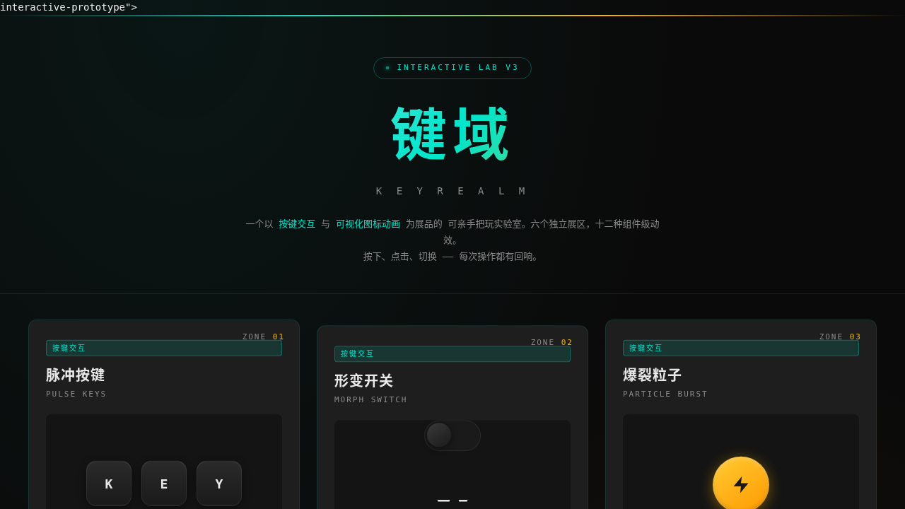

# 键域 KEYREALM

> 日期：2026-08-17 · 方向：V3 UX 交互设计 · 主题：按键交互与图标动画实验室

## 简介

一个按键交互与图标动画的视觉实验室。6 个独立展区，每个都是可亲手把玩的组件级交互装置：按键波纹、形变开关、爆裂粒子、SVG 路径描绘、进度环阵、密码序列。炭黑底色 + 电光青 + 暖琥珀的暗色科技风。

## 截图

## 动效亮点

- 脉冲按键：K/E/Y 触发波纹扩散 + 双色辉光
- 形变开关：弹簧滑动 + SVG 路径 cross-fade
- 爆裂粒子：冲击波环 + 物理粒子雨（重力+初速度）
- SVG 路径描绘器：stroke-dasharray 绘制 + 3 形状切换
- 进度环阵：三环异步联动 + 数字滚动 + 辉光描边
- 密码序列：错误抖动 + 成功粒子爆破 + 连对计数

## 键盘操作

- `K` / `E` / `Y` — 触发脉冲键
- `1` / `2` / `3` — 切换路径形状
- `↑` / `↓` — 调节进度环
- `数字键` — 输入密码
- `空格` / `B` — 触发粒子爆裂

## 在线预览

https://dcniaqwtmoca.feishu.cn/page/RQIkmEwT9dasaIa2O3xc7gugnNb

## 文件说明

| 文件 | 说明 |
|------|------|
| index.html | 完整单页实验室源码（vanilla HTML/CSS/JS） |
| preview.png | 页面截图 |
| thumbnail.png | 缩略图 |
| 设计规范.md | 色彩/字体/组件/动效规范 |

## 技术栈

纯 vanilla HTML/CSS/JS 单文件，零外部依赖（无 React / 无 Babel / 无 CDN）。
