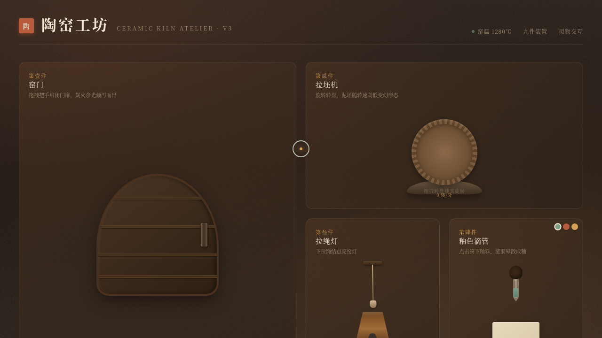

# 陶窑工坊 · 拟物交互实验室

> 日期：2026-08-17 · 方向：V3 UX 交互设计 · 主题：传统陶瓷工坊拟物微交互

## 简介

以「光标驱动的拟物化小组件动画」为展品的可把玩实验室。九件装置取材传统陶瓷工坊——窑门、拉坯机、拉绳灯、釉色滴管、窑温表、陶印、釉彩转盘、竹拨杆、泥条挤出器，每件都用鼠标悬停/点击/拖拽触发细腻的物理微反馈，有场景叙事。

## 配色

陶土红 `#B85C3C` / 生褐 `#5A4028` / 骨白 `#F0E6D2` / 青瓷绿 `#7BA089` / 铁黑 `#2C221B` / 麦秆金 `#D4A056`，暖土色系，零蓝紫渐变。

## 截图

## 动效亮点

自定义光标开屏居中、三态切换、点击涟漪；九件装置各具物理模型：窑门磁吸归位+余烬粒子、拉坯机惯性摩擦、拉绳灯弹簧回弹+暖光扩散、釉色滴管涟漪晕散、窑温表指针走针+温度色变、陶印粉尘四散、釉彩转盘磁吸对位、竹拨杆阻尼回弹、泥条挤出器摆动挤出。

## 妙搭在线预览

https://dcniaqwtmoca.feishu.cn/page/QydmmIpR8d5IeKa9kRIceaBdnFg

## 文件说明

| 文件 | 说明 |
|---|---|
| index.html | 完整可运行源码（纯 vanilla 单文件，CSS/JS 内联） |
| 设计规范.md | 色彩 / 字体 / 装置 / 动效 / 健壮性规范 |
| thumbnail.png | 页面截图 |

## 技术栈

纯 HTML + CSS + 原生 JS，单文件内联，无 React/Babel/外部 CDN 依赖。
