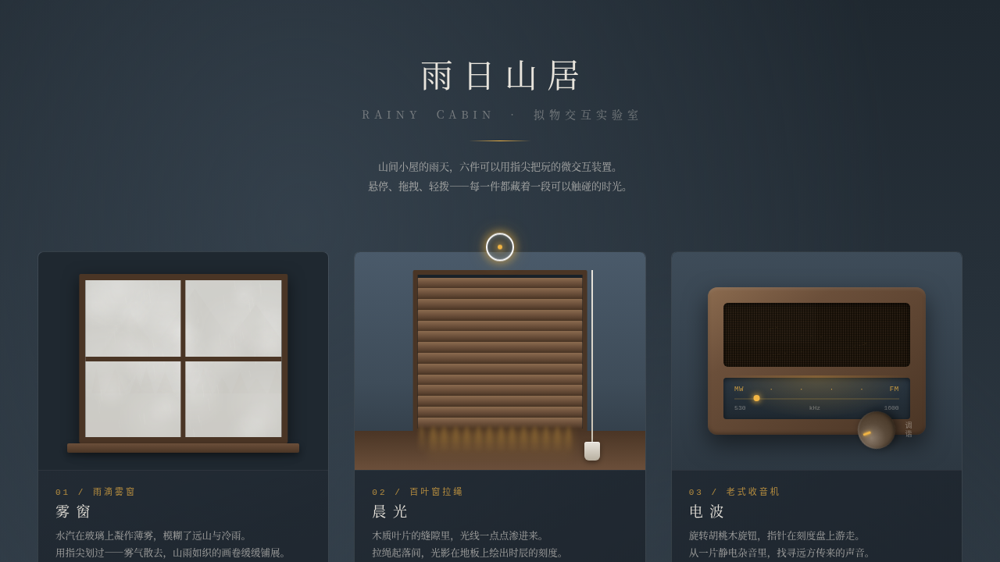

# 雨日山居 Rainy Cabin

> 日期：2026-08-17 · 方向：V3 UX 交互设计 · 主题：雨日山居拟物化小组件动画实验室

## 简介

山间小屋雨天的六个拟物化微交互装置展区，每个展区是一个独立的、有场景叙事的拟物化装置，须用鼠标光标上手操作（悬停/点击/拖拽）才有意义。雨灰蓝基调配暖黄灯火与雾白，呈现雨天山居的湿润静谧。纯 vanilla 单文件实现，无框架/无 CDN 依赖。

## 截图

## 六个展区

1. 雾窗 — 拖拽擦拭雾气露出雨景
2. 晨光（百叶窗）— 拖拽拉绳调节叶片开合与光影
3. 电波（收音机）— 拖拽旋转旋钮调台
4. 炉火（壁炉）— 拖拽木柴入炉，火苗变旺
5. 风铃（檐下）— 悬停/轻拨金属管
6. 茶烟（热茶杯）— 悬停杯面，热气升腾

## 动效亮点

- 弹簧阻尼积分器（百叶窗拉绳、风铃摆动）、惯性摩擦（旋钮旋转）
- 粒子系统（火焰、火星、蒸汽、雨滴）
- 自定义光标（白粗环 + 暖色内点 + 多层发光），开页即居中显示，z-index 最高
- 14+ 组件级特效，visibilitychange 暂停 RAF，支持 prefers-reduced-motion

## 文件说明

| 文件 | 说明 |
|------|------|
| index.html | 完整可运行源码（纯 vanilla HTML/CSS/JS 单文件） |
| 设计规范.md | 色彩系统、字体、展区、动效、物理模型 |
| preview.png / thumbnail.png | 页面截图 |

## 妙搭在线预览

https://dcniaqwtmoca.feishu.cn/page/MQphmo6GdddrFsadrQqcGUQcnFQ

## 技术栈

纯 vanilla HTML/CSS/JS，无 React / 无 Babel / 无外部 CDN 依赖，requestAnimationFrame 动效循环。
