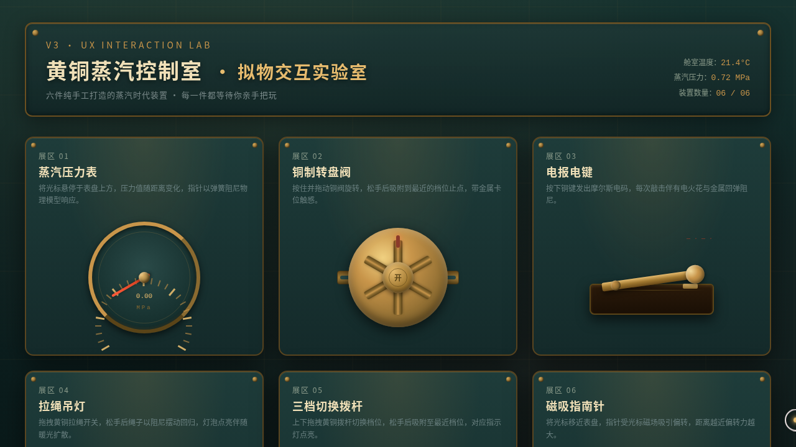

# 黄铜蒸汽控制室 Brass Steam Control · 拟物化微交互实验室

> 日期：2026-08-17 · 方向：V3 UX 交互设计 · 主题：复古蒸汽朋克控制室面板

## 简介

一套深青绿工业墙面 × 暖黄铜 × 氧化铜红的蒸汽朋克控制室面板，六个光标驱动的拟物化微交互装置：蒸汽压力表、铜制转盘阀、电报电键、拉绳吊灯、三档拨杆、磁吸指南针。每个展区以鼠标悬停/点击/拖拽触发细腻物理反馈。

## 设计说明

- 配色：深青绿底 + 暖黄铜 + 氧化铜红 + 暖灯橙光（禁蓝紫渐变）
- 字体：PingFang SC（标签）/ Courier New（刻度）
- 全部动效基于弹簧/阻尼/反平方引力等物理模型，周期各不相同
- 纯 vanilla 单文件，零外部依赖

## 截图

## 动效亮点

自定义光标双环三态切换、压力针弹簧阻尼、阀盘六档吸附、电键回弹电火花、拉绳弹簧回缩+单摆阻尼+灯泡辉光、拨杆三档吸附指示灯、磁针磁场偏转。

## 妙搭在线预览

https://dcniaqwtmoca.feishu.cn/page/RVI0mHQpsd4RTfabeXKckc3InUh

## 文件说明

| 文件 | 说明 |
|------|------|
| index.html | 完整可运行源码（纯 vanilla 单文件） |
| 设计规范.md | 色彩、字体、展区、动效系统 |
| preview.png | 页面截图 |
| thumbnail.png | 缩略图 |

## 技术栈

纯 vanilla HTML/CSS/JS 单文件，无 React/Babel/CDN 依赖。
