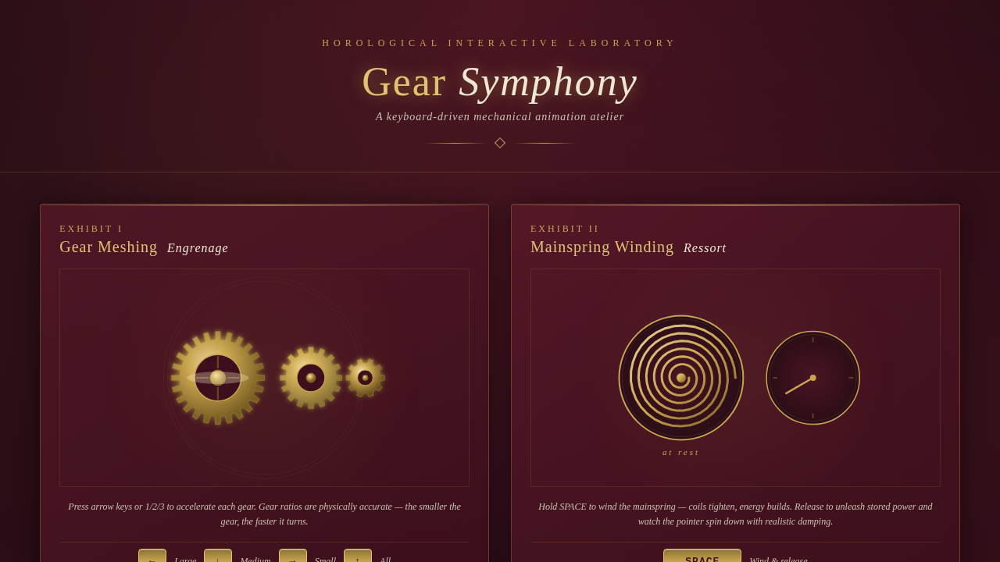

# 齿轮交响曲 Gear Symphony · UX 交互设计

> 日期：2026-08-17 · 方向：V3 UX 交互设计 · 主题：键盘触发的机械齿轮与精密钟表交互装置实验室

## 简介

齿轮交响曲是一个以按键交互与可视化图标动画为展品的可亲手把玩实验室，采用黄铜金+深酒红+奶油的配色，模拟精密钟表的机械质感。6 个独立展区，每个通过键盘按键/按钮点击/开关切换触发，基于物理传动比、阻尼、擒纵机构等机械原理驱动动画。

## 截图

## 动效亮点

- 齿轮咬合传动比联动（大齿轮慢、小齿轮快，方向键加速）
- 发条上弦螺旋收紧 + 释放后阻尼减速
- 擒纵机构扭摆振荡 + 棘轮步进节拍器
- 指针风暴（A/S/D/F/G 多键叠加形成交响）
- 开关矩阵弹性形变 + 涟漪扩散
- SVG 图标 morphing 拆解→重组
- 粒子爆发 + 光晕扩散（按键触发）

## 展区

| 展区 | 按键 | 机制 |
|------|------|------|
| 齿轮咬合 | ←↓→↑ / 1/2/3 | 传动比联动 |
| 发条上弦 | 按住 SPACE | 螺旋收紧 + 阻尼释放 |
| 擒纵机构 | E | 扭摆振荡 + 棘轮步进 |
| 指针风暴 | A/S/D/F/G | 多指针独立加速 |
| 开关矩阵 | 点击 | 弹性形变 + 涟漪 |
| 图标变奏 | 1-6 | SVG morphing |

## 文件说明

| 文件 | 说明 |
|------|------|
| index.html | 完整可运行源码（纯 vanilla HTML/CSS/JS 单文件，无外部依赖） |
| 设计规范.md | 色彩系统、字体、组件规范、动效系统、展区结构 |
| thumbnail.png | 页面截图 |

## 妙搭在线预览

https://dcniaqwtmoca.feishu.cn/page/LjXEmnBn2ddbsSayuQ5cTpkgnYb

## 技术栈

纯 vanilla HTML / CSS / JavaScript（单文件，无 React / 无 Babel / 无 CDN 依赖）
