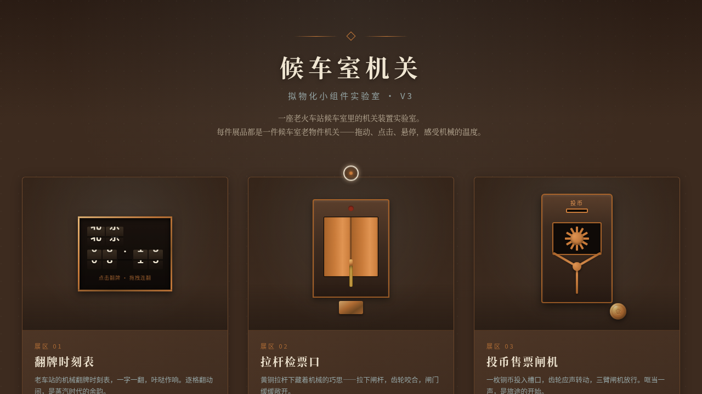

# 候车室机关 · 拟物化小组件实验室

> 日期：2026-08-18 · 方向：V3 UX 交互设计 · 主题：老火车站候车室拟物化机关装置实验室

## 简介

一座老火车站候车室里的拟物化机关装置实验室，6 件展品全部由鼠标光标拖拽 / 点击 / 悬停驱动：翻牌时刻表、拉杆检票口、投币闸机、拨盘售票机、拉杆煤气灯、行李转盘。强调物理质感、机械反馈与场景叙事。

## 配色

深栗 `#3d2b1f` · 烟青 `#7a8b8b` · 铜橙 `#c97b3a` · 奶油 `#f0e6d2`

## 动效亮点

- 拖拽惯性 + 弹簧回弹 + 磁性吸附归位
- 翻牌机械咔哒 / 齿轮转动 / 火花粒子
- 拉杆灯光线扩散与阴影联动
- 行李转盘 3D 透视椭圆路径

## 文件说明

| 文件 | 说明 |
|---|---|
| index.html | 完整可运行源码（纯 vanilla 单文件） |
| preview.png | 页面预览截图 |
| 设计规范.md | 色彩 / 字体 / 展区 / 动效 / 物理模型规范 |

## 在线预览

https://dcniaqwtmoca.feishu.cn/page/IGGXmJR9rdPofjaOQWCcD4AnnPd

## 技术栈

纯 HTML / CSS / JavaScript 单文件，无框架、无 CDN 依赖、无构建步骤。
