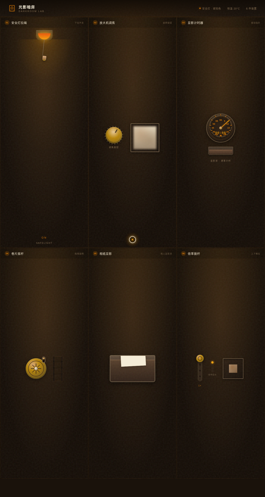

# 光影暗房 Darkroom

- **日期**：2026-08-18
- **方向**：V3 UX 交互设计
- **主题**：老式照相馆暗房拟物化小组件动画实验室
- **配色**：暗房深棕黑 + 安全灯琥珀橙 + 相纸奶白 + 暗红点缀（严禁蓝紫渐变）

## 简介

一个以「光标驱动的拟物化小组件动画」为展品的可把玩实验室，6 个展区全部为暗房场景叙事的拟物化微交互装置，必须用鼠标光标悬停/点击/拖拽上手操作：安全灯拉绳开关、放大机调焦旋钮、显影计时器转盘、胶片卷片摇杆、相纸显影盘、倍率拨杆。每个装置交互反馈细腻、有物理质感。

## 截图

## 动效亮点

- 6 个拟物化装置全部基于物理模型：单摆、弹簧（Hooke）、惯性、摩擦阻尼、磁吸归位、涟漪扩散、液面波纹、胶片齿孔吸附、合焦峰值等
- 自定义光标：开页居中显示，白环 + 琥珀内点 + 多层发光，悬停放大变色、点击涟漪
- 16+ 组件级物理特效

## 在线预览

[光影暗房 · 妙搭在线预览](https://dcniaqwtmoca.feishu.cn/page/E6jDmT611dTJataBQu4c6w0AnAe)

## 文件说明

| 文件 | 说明 |
|------|------|
| index.html | 完整源码（纯 vanilla HTML + 内联 CSS + 内联 JS），单文件可直接运行 |
| preview.png | 预览截图（1280×2400） |
| 设计规范.md | 色彩系统、字体、展区清单、动效系统、健壮性 |

## 技术栈

纯 vanilla HTML/CSS/JS 单文件实现，无 React / 无 Babel / 无外部 CDN 依赖，从根本上规避妙搭平台白屏风险。
