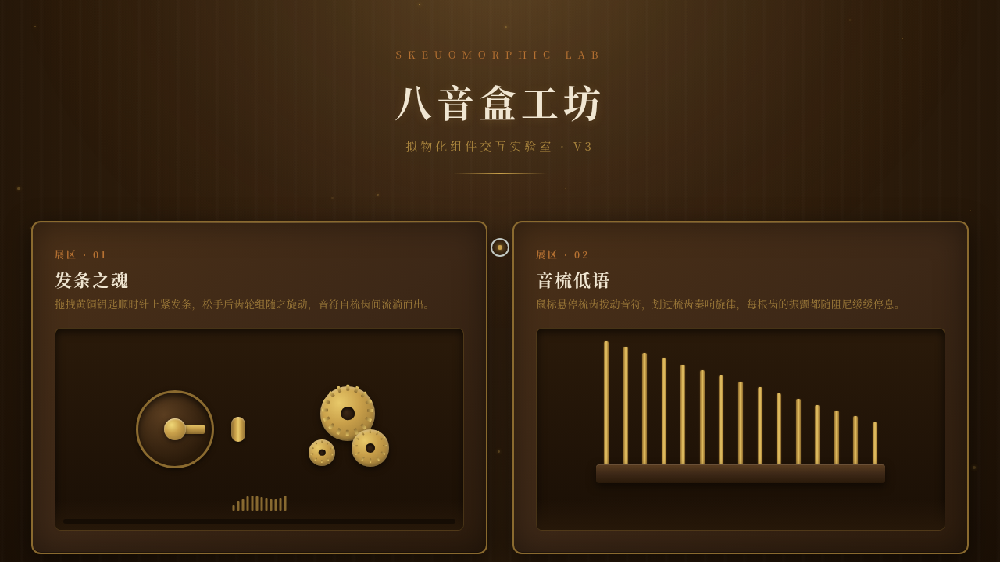

# 八音盒工坊 · 拟物化组件实验室

> 日期：2026-08-18 · 方向：V3 UX 交互设计 · 主题：八音盒拟物化小组件动画

## 简介

八音盒工坊是一个以「光标驱动的拟物化小组件动画」为展品的可把玩实验室。整体场景设定在一个木质工作台上，台上摆放着六种八音盒相关的机械装置组件。每个展区是独立的、有场景叙事的拟物化微交互装置，需要用鼠标光标悬停/点击/拖拽操作。以深胡桃木为底色，黄铜金为主强调色，营造温暖复古的工坊氛围。

## 截图

## 六大展区

1. **发条之魂** — 拖拽黄铜钥匙上发条，渐进阻力+松手回弹驱动齿轮旋转
2. **音梳低语** — 悬停 15 根梳齿触发阻尼振动+音符光点飘散
3. **星光调速盘** — 拖拽旋钮调速（0.5x-2x），棘轮顿挫吸附
4. **音筒雕刻台** — 点击网格放置音钉，旋转触发音符
5. **启停之杆** — 扳动拉杆启停装置，弹簧阻力+磁性吸附
6. **盒盖开启** — 拖拽盒盖开合，重力+惯性回荡+缝隙光线溢出

## 动效亮点

- 自定义光标（白环+黄铜金点+发光+形态切换+点击涟漪+拖拽牵引线）
- 发条渐进阻力（Hooke 弹簧定律）+ 松手回弹
- 音梳阻尼振动（振幅指数衰减）
- 棘轮刻度吸附+弹跳确认
- 盒盖重力开合+惯性回荡
- 木屑粉尘粒子漂浮
- 顶部灯光光晕呼吸
- 共 15 项组件级特效

## 物理模型

- 发条：Hooke 弹簧定律，渐进阻力，释放时角速度衰减
- 音梳：阻尼振动，振幅指数衰减
- 调速盘：棘轮刻度吸附+弹跳确认
- 拉杆：弹簧+反平方磁性吸附
- 盒盖：重力+阻尼+惯性回荡

## 文件说明

| 文件 | 说明 |
|------|------|
| `index.html` | 完整源码（HTML+CSS+JS 单文件） |
| `设计规范.md` | 色彩系统、字体、展区结构、动效、物理模型规范 |
| `preview.png` | 页面截图 |
| `thumbnail.png` | 缩略图 |

## 妙搭在线预览

https://dcniaqwtmoca.feishu.cn/page/MXRim0Au3dgvMNaC6sDc5ASFn8b

## 技术栈

纯 vanilla HTML/CSS/JS 单文件，无 React/Babel/CDN 依赖，Canvas 2D 渲染粒子系统，CSS 3D transform 实现翻转和开合。
