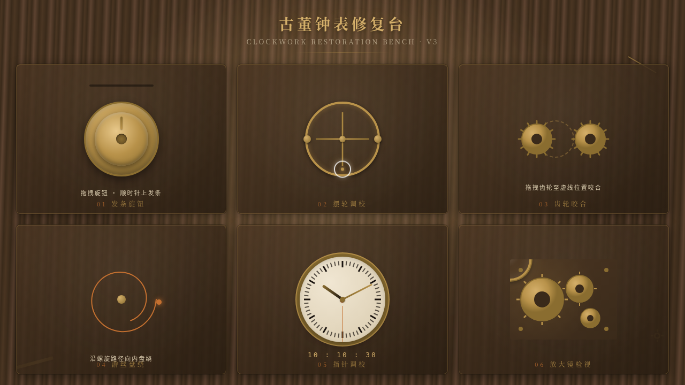

# 古董钟表修复台 · V3 UX 交互设计

**日期**：2026-08-18  
**方向**：UX 交互设计  
**主题**：古董钟表修复台 — 拟物化钟表机芯修复工作台交互实验室

## 简介

「古董钟表修复台」是一个以光标驱动的拟物化小组件动画为核心的交互实验室。场景设定在一间昏黄的钟表修复工作室，用户用鼠标光标在黄铜色修复台上操作各种钟表机芯组件——上发条、调校摆轮、咬合齿轮、盘绕游丝、调校指针、放大检视，每个展区都是独立的拟物化微交互装置。

## 截图

## 设计亮点

- **6 个拟物化展区**：发条旋钮、摆轮调校、齿轮咬合、游丝盘绕、指针调校、放大镜检视
- **物理质感交互**：阻尼、弹簧 Hooke 定律、磁性反平方引力、惯性动量、贝塞尔曲线
- **场景叙事**：昏黄台灯、黄铜桌面、散落齿轮，营造修复工作室氛围
- **自定义光标变形**：悬停可交互元素时变为放大镜形态

## 动效亮点

12+ 个组件级特效：自定义光标（放大镜变形）、发条阻尼旋转、摆轮弹簧衰减、齿轮磁力吸附、游丝贝塞尔跟随、指针磁性归位+联动、放大镜区域放大+光影、台灯光晕偏移、齿轮 RAF 积分器、拖拽涟漪、悬停发光、展区错峰淡入。

## 文件说明

| 文件 | 说明 |
|------|------|
| index.html | 完整可运行源代码（纯 vanilla HTML/CSS/JS 单文件） |
| 设计规范.md | 色彩系统、字体、组件规范、动效系统、展区结构 |
| thumbnail.png | 页面预览截图 |

## 妙搭在线预览

https://dcniaqwtmoca.feishu.cn/page/TmSlmCBHrdL1GTabAE2csooHnms

## 技术栈

- 纯 vanilla HTML / CSS / JavaScript（无 React / 无 Babel / 无外部 CDN 依赖）
- Canvas / SVG（部分视觉效果）
- requestAnimationFrame（物理动画积分）
- CSS animation / transition
