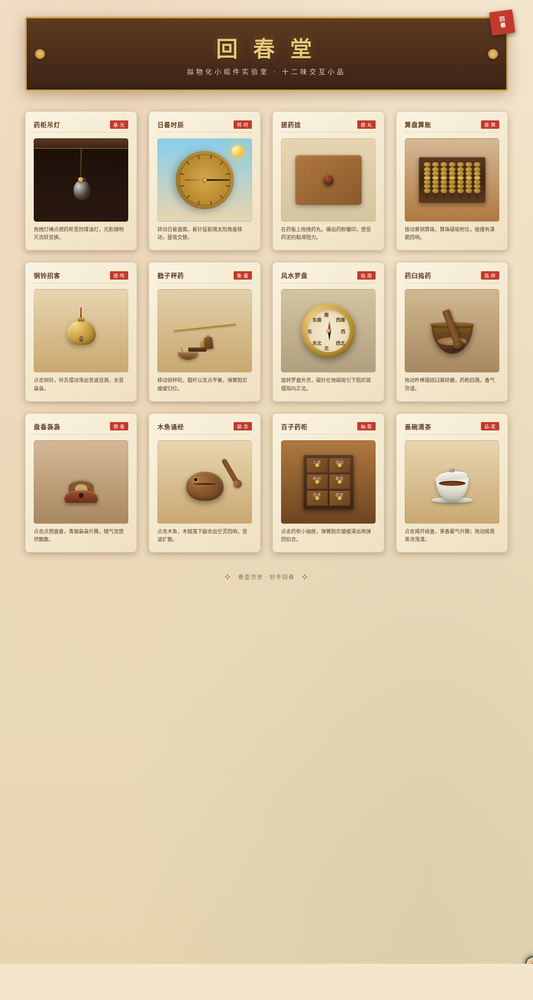

# 回春堂 · V3 UX 交互设计

**方向：** V3 UX 交互设计
**日期：** 2026-08-18
**主题：** 回春堂 — 传统中药铺拟物化小组件实验室

## 简介

以光标驱动的拟物化微交互为展品的可把玩实验室。十二味交互小品（药柜吊灯、日晷时辰、搓药捻、算盘算账、铜铃招客、戥子秤药、风水罗盘、药臼捣药、盘香袅袅、木鱼诵经、百子药柜、盖碗清茶），每个展区须用鼠标悬停 / 点击 / 拖拽上手操作，反馈细腻、有物理质感与场景叙事。宣纸暖米黄 + 朱红 + 黄铜 + 木棕配色。纯 Vanilla 单文件实现。

## 截图

## 动效亮点

- 自定义光标开页即居中，悬停 / 点击 / 拖拽三态 + 点击涟漪
- 每处交互基于弹簧 / 阻尼 / 惯性 / 磁吸物理模型
- 灯绳弹簧回弹、算珠磁吸碰撞、罗盘磁针阻尼指北、药粉粒子重力四溅、青烟飘摇升腾

## 文件说明

| 文件 | 说明 |
|------|------|
| index.html | 完整可运行源码（纯 Vanilla，无外部依赖） |
| preview.png | 页面截图 |
| thumbnail.png | 妙搭平台缩略图 |
| 设计规范.md | 色彩 / 字体 / 十二展品 / 动效规范 |

## 妙搭在线预览

https://dcniaqwtmoca.feishu.cn/page/VfyqmplKKddWFZa0tWlcn1BZnMb

## 技术栈

纯 HTML / CSS / JavaScript（Vanilla，无 React / Babel / CDN 依赖）
