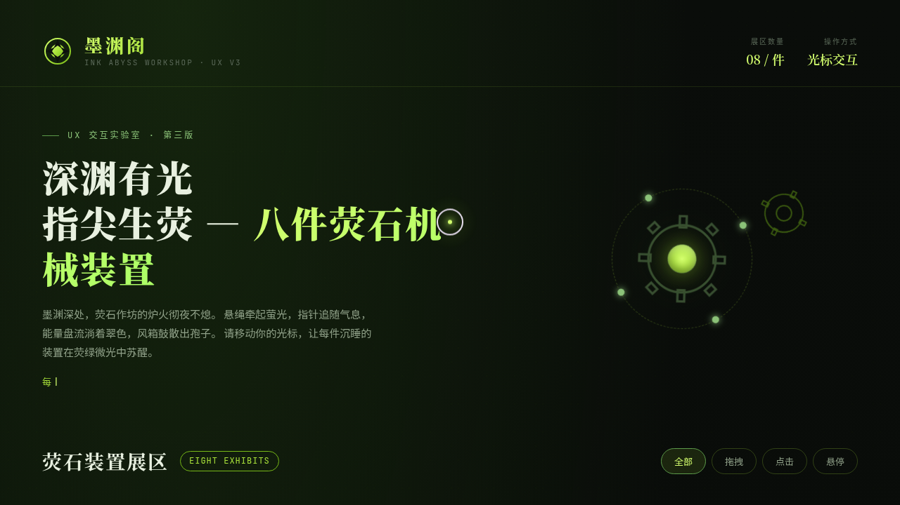

# 墨渊阁 · 荧石作坊 UX 交互实验室

> 日期：2026-08-18 · 方向：V3 UX 交互设计 · 主题：深夜荧石作坊——光标驱动的拟物化小组件动画

## 简介

「墨渊阁」是一座深夜荧石作坊，每件展品都是一件可上手把玩的手工机械装置。配色取墨黑深绿为底、荧黄绿与苔藓绿为主，营造荧光苔藓森林的幽光氛围。八件交互装置均以鼠标光标悬停 / 点击 / 拖拽驱动，反馈细腻、有物理质感与场景叙事。

## 截图

## 动效亮点

- 自定义光标：三环三层 + 悬停 / 点击态 + 涟漪，开页即居中
- 八件拟物化装置：荧石吊灯（弹簧拉绳）、苔藓指南针（反平方引力）、荧石能量盘（拖拽旋转）、孢子风箱（按压回弹 + 火花）、荧曙光暮（昼夜滑块）、苔藓涟漪、荧石留声机、玉石平衡秤
- 12+ 组件级特效：背景粒子、齿轮旋转、脉冲发光、3D 倾斜、荧液流动、声波扩散等

## 文件说明

| 文件 | 说明 |
|------|------|
| index.html | 完整可运行源码（纯 vanilla HTML/CSS/JS 单文件） |
| 设计规范.md | 色彩 / 字体 / 装置 / 动效规范 |
| thumbnail.png | 页面截图 |

## 在线预览

https://dcniaqwtmoca.feishu.cn/page/HNnxmR1JsdGFcwa5N8acG6xDnAg

## 技术栈

纯 vanilla HTML/CSS/JS 单文件实现（无 React / 无 Babel / 无外部 CDN 依赖）；支持 `prefers-reduced-motion` 降级。
