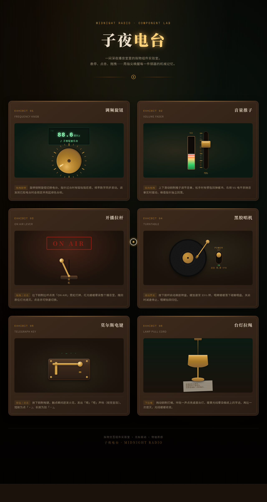

# 子夜电台 · 播音室组件实验室

> 日期：2026-08-18 · 方向：V3 UX 交互设计 · 主题：深夜电台播音室拟物化小组件动画实验室

## 简介

一个以「光标驱动的拟物化小组件动画」为展品的可把玩实验室，六个独立展区围绕深夜电台播音室场景叙事：调频旋钮、音量推子、开播拉杆、黑胶唱机、莫尔斯电键、台灯拉绳。每个展区必须用鼠标光标上手操作（悬停/点击/拖拽）才有意义，交互反馈基于物理模型（弹簧/惯性/磁性吸附/阻尼），细腻有质感。胡桃木深棕 + 铜金 + 墨绿 + 暖黄灯光的配色呼应老式播音室语义。纯 vanilla 单文件实现，零外部依赖。

## 截图

## 动效亮点

- 调频旋钮：拖拽旋转 + 物理惯性 + 7 电台磁吸锁定 + 频率数字滚动
- 音量推子：纵向拖拽阻尼回弹 + VU 电平表实时摆动 + 峰值保持
- 开播拉杆：霓虹 ON AIR 灯牌点亮 + 红光光晕扩散
- 黑胶唱机：转盘缓加速至 33⅓ RPM + 唱臂缓缓落下
- 莫尔斯电键：触点火花 + 短按为点·长按为划—
- 台灯拉绳：弹簧阻力 + 咔哒点亮 + 暖光晕染稿纸
- 自定义光标 4 态（跟随/悬停放大/拖拽虚线/点击涟漪），开页即显示在屏幕中央（共 16 项组件级特效）

## 妙搭在线预览

https://dcniaqwtmoca.feishu.cn/page/IgD6mAwnJdERGqaeglEcRRKPnMh

## 文件说明

| 文件 | 说明 |
|---|---|
| index.html | 完整可运行源码（内联 CSS/JS，纯 vanilla） |
| preview.png | 页面截图（1280×2400） |
| thumbnail.png | 平台缩略图 |
| 设计规范.md | 色彩/字体/动效/展区规范 |

## 技术栈

HTML5 + Canvas/SVG + 原生 JS（requestAnimationFrame 物理积分器）。
