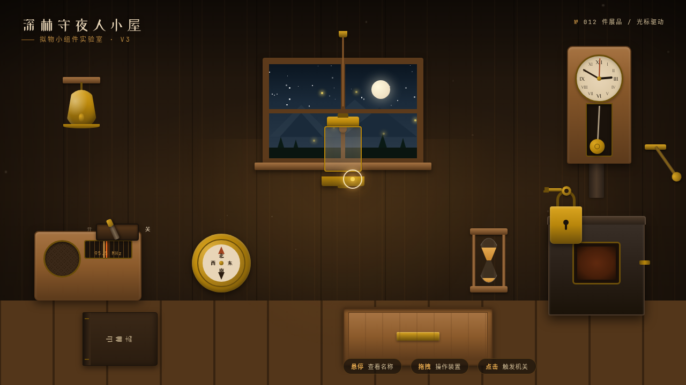

# 深林守夜人小屋 · 拟物小组件实验室

- 日期：2026-08-18
- 方向：V3 UX 交互设计
- 主题：深林守夜人小屋 — 光标驱动的拟物化小组件动画实验室

## 简介

寒夜木屋中的 12 件可把玩器物：拉绳吊灯、壁炉风门、黄铜铃、老收音机、橡木抽屉、座钟、夜森林窗户、指南针、沙漏、木拨昼夜开关、古籍、铜锁与钥匙。每件都以鼠标光标悬停 / 点击 / 拖拽触发细腻微交互，带物理质感与场景叙事。胡桃木 + 琥珀金 + 铁锈红暖木配色，纯 vanilla 单文件实现。

## 截图

## 动效亮点

自定义提灯光标（开页居中、拖拽虚线、点击涟漪）、弹簧拉绳、阻尼单摆座钟、火星粒子壁炉、萤火虫夜窗、磁性吸附铜锁、3D 翻页古籍、声波扩散铜铃等 14+ 组件级特效。

## 文件说明

| 文件 | 说明 |
|---|---|
| index.html | 完整可运行源码（纯 vanilla HTML/CSS/JS 单文件） |
| 设计规范.md | 色彩变量、字体、12 件展品、动效、组件规范 |
| preview.png | 页面预览截图 |

## 妙搭在线预览

https://dcniaqwtmoca.feishu.cn/page/IIGam1lsudpeZ3aCrCVclPCXnBd

## 技术栈

纯原生 HTML / CSS / JavaScript 单文件，无 React / 无 Babel / 无外部 CDN 依赖。
