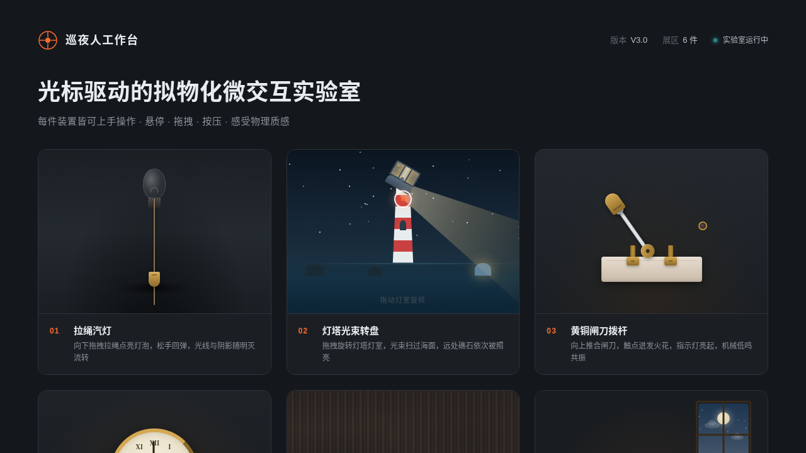

# 巡夜人工作台 · V3 UX 交互设计

- 日期：2026-08-18
- 方向：V3 UX 交互设计
- 主题：巡夜人工作台 —— 光标驱动拟物化微交互实验室
- 配色：深空石墨 + 银白 + 信号橙 + 冷青

## 简介

深夜巡夜人的微交互装置实验室，6 件拟物化微交互装置全部用鼠标光标上手操作（悬停/点击/拖拽）：拉绳汽灯、灯塔光束转盘、黄铜闸刀拨杆、怀表上弦旋钮、磁吸巡更牌、油灯调光阀。每件装置有独立场景叙事与细腻物理反馈（弹簧回弹 / 阻尼 / 磁吸 / 光线扩散）。

## 截图展示

## 动效亮点

- 拉绳汽灯：拖拽点亮 + 光线扩散 + 弹簧回弹
- 灯塔光束：拖拽旋转 + 光束扫海 + 礁石照亮
- 黄铜闸刀：推合 + 火花粒子 + 吸附归位
- 怀表上弦：旋转阻尼 + 发条 + 指针走动
- 磁吸巡更牌：反平方引力 + 惯性过冲回弹
- 油灯调光阀：旋转调火苗 + 昼夜过渡
- 自定义光标：开页居中、三态切换、点击涟漪

## 文件说明

| 文件 | 说明 |
|---|---|
| index.html | 入口页面（内联结构） |
| css/styles.css | 全部样式 |
| js/core.js | 物理工具集 + RAF/定时器管理器 |
| js/main.js | 初始化 + 光标系统 |
| js/widgets/*.js | 6 个装置实现（gas-lamp/knife-switch/lighthouse/magnetic-tag/oil-lamp/pocket-watch） |
| preview.png | 页面截图 |
| 设计规范.md | 色彩 / 字体 / 组件 / 动效 / 展区规范 |

## 在线预览

https://dcniaqwtmoca.feishu.cn/page/FPkQmBGyhdV4fCaJKWBcXifMnbc

## 技术栈

纯 vanilla HTML/CSS/JS 单文件实现，无 React / 无 Babel / 无外部 CDN 依赖。
