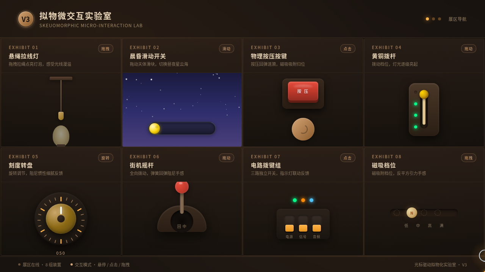

# 拾光修理铺 · 拟物微交互实验室

> 日期：2026-08-18 · 方向：V3 UX 交互设计 · 主题：光标驱动的拟物化小组件动画

暖棕黄铜色调的老物件修理铺场景，8 组光标驱动的拟物化微交互装置：悬绳拉线灯、晨昏滑动开关、物理按压按键、黄铜拨杆、刻度转盘、街机摇杆、电路拨键组、磁吸档位。每个展区必须上手拖拽/悬停/点击才有意义，全部基于弹簧、阻尼、惯性、反平方引力等物理模型。

## 动效亮点

- 自定义光标（白环 + 琥珀内点 + 三层光晕，开页即居中，拖拽态变形）
- 拖拽拉绳点灯：弹簧阻尼回弹 + 灯光扩散脉动
- 日月滑块：天空渐变 + 星空闪烁 + 云朵飘移的场景叙事切换
- 磁吸按钮/档位：反平方引力吸附 + elastic 缓动归位
- 刻度转盘阻尼惯性旋转、摇杆全向 3D 弹簧回弹

## 文件说明

| 文件 | 说明 |
|------|------|
| `index.html` | 完整单文件应用（纯 vanilla，无外部依赖） |
| `设计规范.md` | 色彩/字体/展品/动效规范 |
| `preview.png` / `thumbnail.png` | 页面截图 |
| `README.md` | 本文件 |

## 在线预览

https://dcniaqwtmoca.feishu.cn/page/KgfemVeCRdq3JwaPtgMcFmXUndb

## 技术栈

妙搭 HTML 应用 · 纯 vanilla HTML/CSS/JS 单文件（无 React / Babel / CDN）· 统一 RAF 调度器
