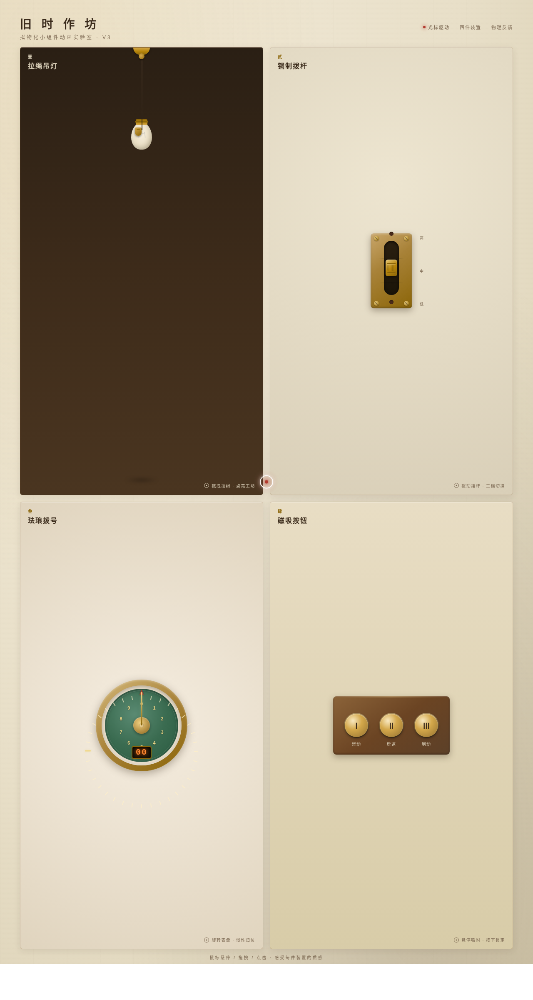

# 旧时作坊 · V3 UX 交互设计

**日期**：2026-08-18
**方向**：V3 UX 交互设计（光标驱动拟物化小组件动画）
**主题**：旧时作坊 —— 拟物化小组件动画实验室

## 简介
四个展区各为独立的、有场景叙事的拟物化微交互装置，核心是鼠标光标悬停/移动/点击/拖拽触发的细腻微交互。每个展区必须用光标上手操作才有意义，交互反馈细腻、有物理质感、有场景叙事。

## 四件交互装置
- **壹 · 拉绳吊灯** — 拖拽底部拉环摆动钟摆，过零点亮灯泡，伴随光线扩散与地面阴影变化（弹簧+阻尼物理摆动）
- **贰 · 铜制拨杆** — 三档拨杆开关，拖拽松手后磁吸吸附至最近档位，对应红铜指示灯亮起
- **叁 · 珐琅拨号盘** — 拖拽旋转表盘，松手后惯性衰减，指针指向 0-9 数字，归位时微磁吸咔嗒感
- **肆 · 磁吸按钮组** — 光标靠近时按钮被"吸引"位移（反平方律磁力），点击下压涟漪+8 粒火花扩散

## 设计说明
- 配色：黄铜金+深墨棕+暗红铜+奶油米，旧时作坊暗调质感，无蓝紫渐变
- 自定义光标：白色粗环+朱砂内点+暖光晕，三态 morph（悬停/拖拽/点击）

## 动效亮点
- 钟摆弹簧+阻尼物理摆动
- 拨杆惯性回弹+档位磁吸
- 表盘惯性旋转+刻度咔嗒
- 按钮反平方律磁力位移+按压涟漪+火花粒子

## 截图

## 妙搭在线预览
https://dcniaqwtmoca.feishu.cn/page/MxGNmW23nd8FPSaiNQacT68snWb

## 文件说明
| 文件 | 说明 |
|------|------|
| index.html | 完整源码（纯 vanilla HTML/CSS/JS 单文件） |
| preview.png | 页面截图 |
| 设计规范.md | 色彩系统、字体、组件、动效规范 |
| thumbnail.png | 缩略图 |

## 技术栈
纯 vanilla HTML/CSS/JS 单文件，无外部依赖，无 React/Babel/CDN
