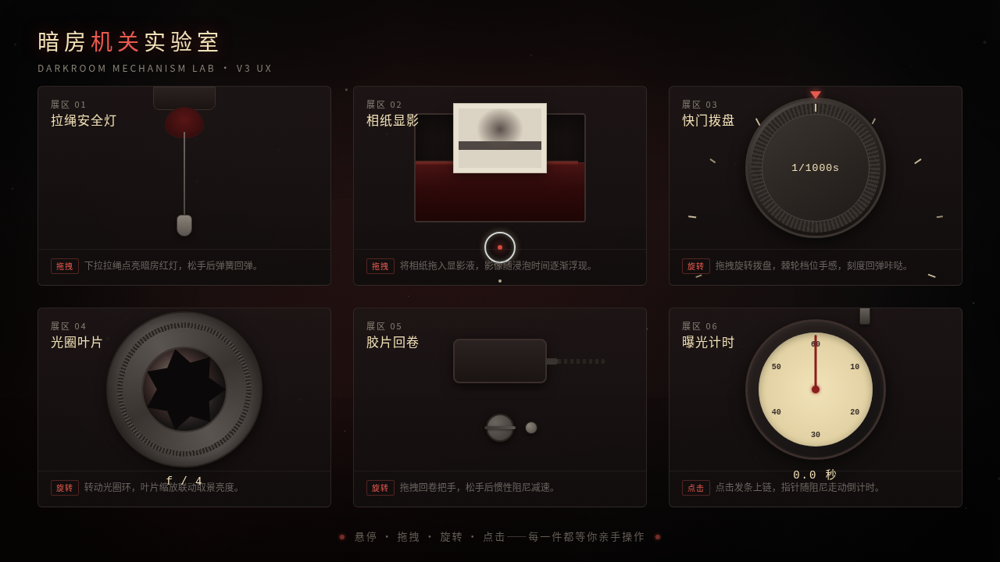

# 暗房机关 · UX 交互设计 Mock

> 日期：2026-08-18 · 方向：V3 UX 交互设计 · 主题：老照相馆暗房拟物化微交互实验室

## 简介

「暗房机关」是一间老照相馆暗房里的拟物化微交互实验室，6 件可上手把玩的暗房装置：拉绳安全灯（拖拽点亮红光）、相纸显影（拖相纸入液渐进浮现）、快门拨盘（拖拽旋转棘轮回弹）、光圈叶片（旋转联动取景亮度）、胶片回卷（惯性阻尼）、曝光计时器（发条上链阻尼走针）。每个展区以鼠标光标悬停/点击/拖拽操作为主，交互反馈细腻、有物理质感与场景叙事。配色为暗房红 + 炭黑 + 奶黄 + 暗银，禁用蓝紫渐变。

## 动效亮点

- 自定义光标（弹簧跟随 + 三态切换 + 点击涟漪），开页即显示在屏幕中央
- 红光扩散、胶片颗粒、尘埃粒子、暗角呼吸营造暗房氛围
- 弹簧拉绳（Hooke）、棘轮回弹、光圈叶片缩放、惯性阻尼回卷、发条阻尼计时等物理模型驱动

## 文件说明

| 文件 | 说明 |
|------|------|
| index.html | 完整可运行源码（纯 vanilla 单文件，零依赖） |
| 设计规范.md | 色彩/字体/组件/动效/展区结构规范 |
| thumbnail.png | 页面截图 |

## 技术栈

纯 HTML/CSS/JS 单文件，无 React / 无 Babel / 无外部 CDN 依赖。支持 `prefers-reduced-motion` 降级，动画循环随 `visibilitychange` 暂停，拖拽循环统一管理无泄漏。

## 在线预览

[暗房机关 · 妙搭在线预览](https://dcniaqwtmoca.feishu.cn/page/Ot3WmtyvVdtjJjaw1DLc4KWUnre)
