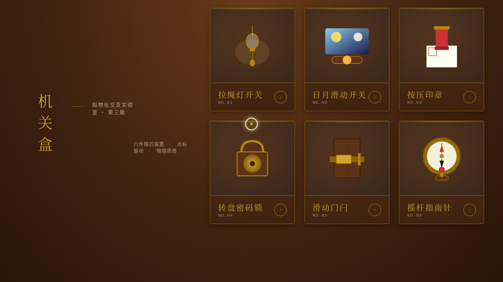

# 机关盒 · V3 UX 交互设计

**日期**：2026-08-18
**方向**：V3 UX 交互设计
**主题**：机关盒 — 拟物化机械机关微交互实验室

## 简介

以"光标驱动的拟物化小组件动画"为展品的可把玩实验室。每个展区是一个独立的、有场景叙事的拟物化微交互装置，核心是鼠标光标悬停/移动/点击/拖拽触发的细腻微交互。配色采用黄铜+深木棕+象牙白+朱砂的古典机械质感色调。

## 截图展示

## 展区亮点（6 个拟物化微交互装置）

1. **拉绳灯开关** — 摆锤自然摆动，下拉点亮，光照扩散+阴影变化，松手弹簧回弹
2. **日月滑动开关** — 滑块惯性摩擦滑动，背景昼夜渐变，云朵/星辰淡入淡出闪烁
3. **按压印章** — 按住压下有深度感，松手弹起，按压时长决定朱印浓淡，宣纸叠印
4. **转盘密码锁** — 旋转惯性+阻尼，40 格刻度咔哒反馈，3 位密码依次对中开锁
5. **滑动门闩** — 横杆滑动带摩擦感，到位卡扣震动，门开时门板微开+门缝光线透出
6. **摇杆指南针** — 左右拖摇杆，磁针带磁性阻尼转向+过冲回摆，72 格精细刻度+方位读数

## 动效亮点

- 自定义光标（白环+黄铜内点+多层发光，悬停放大变色，拖拽变红，点击涟漪）
- 所有物理反馈基于 RAF 积分器（弹簧 Hooke 定律/惯性动量/阻尼/摩擦/磁性吸引）
- 展区卡片悬停抬升+光泽扫过+黄铜边框发光
- 支持 prefers-reduced-motion 降级

## 文件说明

| 文件 | 说明 |
|------|------|
| index.html | 完整源码（纯 vanilla HTML/CSS/JS 单文件） |
| 设计规范.md | 色彩系统、字体、展区结构、动效、物理模型规范 |
| preview.png | 页面截图 |

## 妙搭在线预览

https://dcniaqwtmoca.feishu.cn/page/KJTFm31qhdUnMUainyPcEmOKnEf

## 技术栈

纯 vanilla HTML/CSS/JS 单文件实现（无 React/Babel/CDN），requestAnimationFrame 物理积分器驱动所有微交互。
