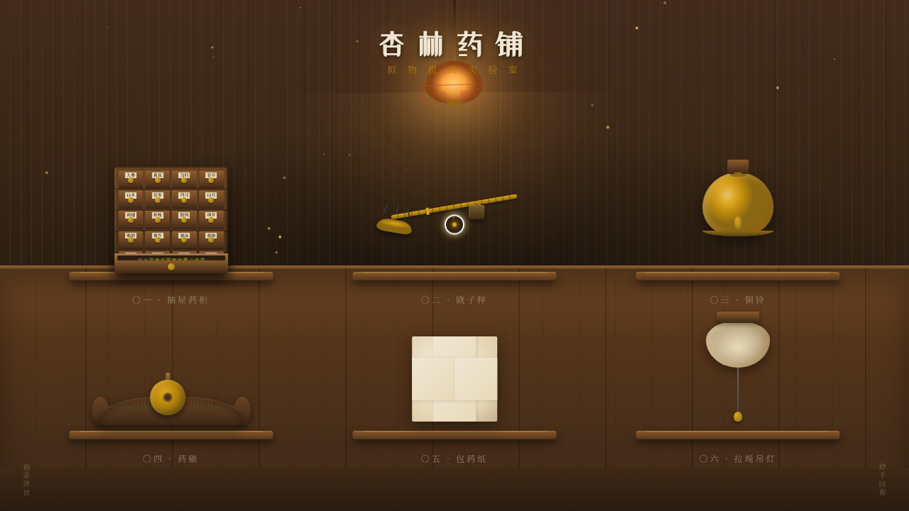

# 杏林药铺 · 拟物机关实验室

> 方向：V3 UX 交互设计　日期：2026-08-18

一家中式老药铺主题的拟物化微交互实验室，6 个展区均为可光标操作（悬停/点击/拖拽）的实体隐喻装置：抽屉药柜、戥子秤、铜铃、药碾、包药纸、拉绳吊灯。每个展区有场景叙事与物理质感反馈，配色取原木棕 + 墨黑 + 铜金 + 宣纸米白。

## 截图

## 动效亮点

- 自定义光标（阻尼跟随 + 悬停放大 + 点击涟漪），开页居中显示
- 抽屉弹簧回弹 + 阻尼（拖拽拉开露出药材）
- 戥子秤杠杆力矩平衡 + 角阻尼振荡（拖动秤砣）
- 铜铃碰撞 + 衰减振荡 + 3 圈音波纹 + WebAudio 铃声
- 药碾摩擦惯性 + 碾轮旋转跟随 + 研磨程度累积
- 包药纸四角错时 3D 翻折 + 药签浮现
- 拉绳吊灯弹簧回弹 + 暖光扩散 + 咔哒音效，开关影响全局亮度
- 尘埃粒子飘浮 + 环境灯微摇摆

共 15+ 组件级特效，基于物理模型，周期各不相同。

## 妙搭在线预览

https://dcniaqwtmoca.feishu.cn/page/NffCmpnW3dgnewaY9THcgQy5nQe

## 文件说明

| 文件 | 说明 |
| --- | --- |
| index.html | 完整可运行源码（纯 vanilla 单文件，无依赖） |
| thumbnail.png | 页面截图（1280×720） |
| 设计规范.md | 色彩/字体/展区/动效/物理模型规范 |

## 技术栈

纯 vanilla HTML/CSS/JS 单文件（无 React / 无 Babel / 无外部 CDN）。RAF 统一管理随页面可见性暂停、卸载清理；支持 prefers-reduced-motion 降级；事件委托覆盖动态元素。
