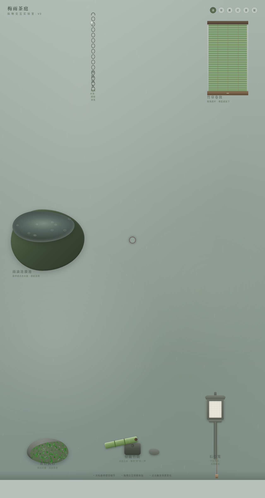

# 梅雨茶庭 · 拟物化小组件实验室

> 日期：2026-08-18 · 方向：V3 UX 交互设计 · 主题：梅雨季日式茶庭拟物化微交互实验室

## 简介

以「光标驱动的拟物化小组件动画」为展品的可把玩实验室，梅雨季湿润灰绿配色。六个展区均为独立场景叙事的拟物化微交互装置，必须用鼠标光标悬停 / 点击 / 拖拽才有意义：雨滴涟漪池、竹帘卷放、惊鹿竹筒、石灯笼、青苔拭石、雨链滴水。

## 动效亮点

- 雨滴涟漪池：悬停微涟漪 / 点击三重同心波（阻尼衰减）
- 竹帘：拖拽卷起，松手弹簧下落归位（Hooke + 阻尼 + 边界回弹）
- 惊鹿竹筒：点击注水蓄满翻转"咚"一声（重心偏移 + 弹簧 + 碰撞）
- 石灯笼：下拉流苏点亮，暖光纸面晕开摇曳（弹簧 + 单摆 + 微闪）
- 青苔拭石：抚过擦除青苔（destination-out 径向笔刷）
- 雨链滴水：拖拽水珠顺链滑落，松手自由落体（重力 + 空气阻力 + 溅水）
- 自定义光标：阻尼跟随 + 悬停放大变色 + 拖拽三态 + 点击涟漪，开页即显示在屏幕中央

共 16+ 组件级特效，6 个展区独立物理积分循环。

## 妙搭在线预览

https://dcniaqwtmoca.feishu.cn/page/UgCTmkVRideol5avFJ7c2c8On3d

## 文件说明

| 文件 | 说明 |
|------|------|
| index.html | 完整可运行源码（纯 vanilla HTML/CSS/JS 单文件，零外部依赖） |
| 设计规范.md | 色彩系统、字体、展区、动效、健壮性 |
| preview.png | 页面截图 |
| README.md | 本说明 |

## 技术栈

纯 vanilla HTML/CSS/JS 单文件（无 React / 无 Babel / 无外部 CDN），Canvas + DOM 物理积分。
