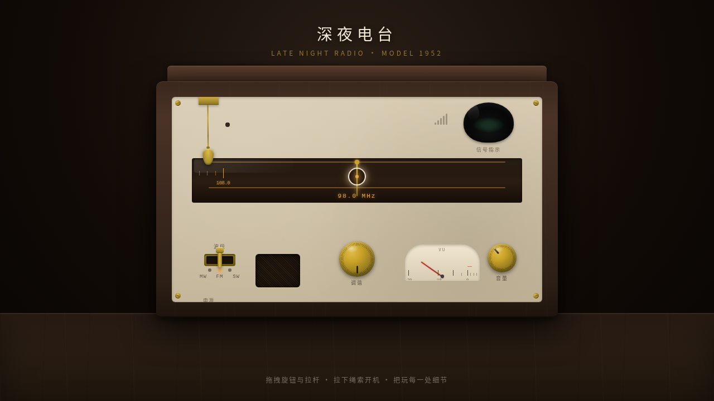

# 深夜电台 · 老式收音机工作台

- 日期：2026-08-18
- 方向：V3 UX 交互设计（光标驱动的拟物化小组件实验室）
- 主题：老式电子管收音机 / 深夜电台

## 简介

一个老式电子管收音机主题的拟物化微交互实验室，6 个可上手把玩的装置：拉绳电源开关、魔术眼电子管、调谐旋钮与刻度盘、波段拨杆、音量旋钮与 VU 表头、天线伸缩杆。所有交互均由鼠标光标悬停 / 点击 / 拖拽驱动，带弹簧、惯性、阻尼、磁吸等物理质感。配色为胡桃木 + 黄铜 + 墨绿辉光 + 暖橙背光。

## 截图

## 动效亮点

- 拉绳拖拽过阈值咔哒回弹，整机通电暖光渐亮
- 魔术眼绿色辉光随信号实时开合
- 调谐旋钮惯性续转、靠近电台磁吸锁定
- 波段拨杆弹簧回弹 + 触点微震、VU 表针过冲回弹
- 自定义光标三态切换（默认 / 悬停黄铜放大 / 拖拽绿色虚线环），开页即居中

## 文件说明

| 文件 | 说明 |
|---|---|
| index.html | 完整单文件应用（纯 vanilla HTML/CSS/JS，无外部依赖） |
| 设计规范.md | 色彩 / 字体 / 展区 / 物理引擎规范 |
| thumbnail.png | 页面截图 |
| README.md | 本文件 |

## 在线预览

https://dcniaqwtmoca.feishu.cn/page/K90Fm8vP0dIBySaWP9pc0yYGnge

## 技术栈

妙搭 html 应用 · 纯 vanilla HTML/CSS/JS 单文件 · RAF 积分器物理引擎
