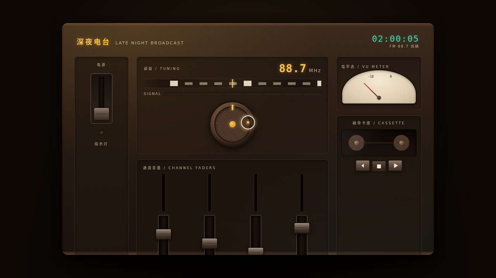

# 深夜电台调音台 Night Radio Console

> 方向：V3 UX 交互设计 · 日期：2026-08-18
> 主题：凌晨两点的电台直播间——光标驱动的拟物化调音台

## 简介

「深夜电台调音台」是一台完整可把玩的拟物化电台调音台，页面即装置。六个独立微交互展区各有场景叙事：电源拨杆开机（电子管预热、指示灯渐亮）、四通道音量推子（拖拽阻尼 + 独立电平表）、调谐转盘（拖拽寻台、信号渐强）、VU 电平表（弹簧指针、可轻拍表罩）、磁带卡座（机械按键、磁带轮正反转）、ON AIR 麦克风推杆（红灯牌亮起、直播间暗化）。胡桃深棕 + 钨丝暖黄 + 孔雀石绿的深夜暖调，纯 vanilla 单文件实现。

## 截图

## 动效亮点

- 自定义光标开页即居中：白色粗环 + 暖黄内点 + 双层发光，悬停放大、拖拽变绿、点击涟漪
- 推子 / 转盘全程可拖拽，带阻尼与惯性；VU 指针弹簧缓动，轻拍表罩会晃动
- 电源开机序列：电流涟漪 → 指示灯渐次点亮 → 电子管预热延迟
- ON AIR 推杆：红灯牌光晕扩散 + 整页灯光暗化的场景叙事

## 文件说明

| 文件 | 说明 |
|---|---|
| `index.html` | 完整单文件源码（纯 vanilla HTML/CSS/JS），可直接浏览器打开预览 |
| `设计规范.md` | 色彩 / 字体 / 圆角 / 展区结构 / 交互与动效系统 |
| `thumbnail.png` | 页面截图 |
| `README.md` | 本文件 |

## 在线预览

妙搭应用：https://dcniaqwtmoca.feishu.cn/page/YhUgmMxXCdV87zagD6icGmianoe

## 技术栈

纯 vanilla HTML / CSS / JavaScript 单文件，零外部依赖；RAF 动画与 DOM transform；`prefers-reduced-motion` 降级。
