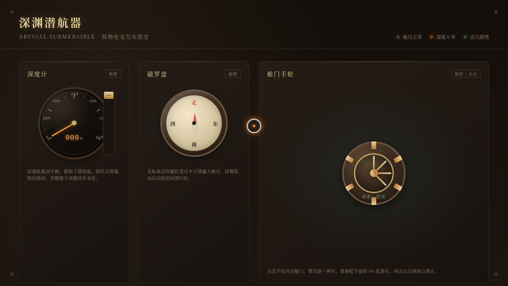

# 深渊潜航器 · 拟物化交互实验室（V3 UX 交互设计）

- **日期**：2026-08-18
- **方向**：V3 UX 交互设计 —— 光标驱动的拟物化小组件动画实验室
- **主题**：深渊潜航器——老式潜水艇指挥舱里的 11 件可把玩装置

## 简介

一座潜水艇指挥舱：深度计、磁罗盘、舱门手轮、节流阀、观察舷窗、声呐、警报灯、摩尔斯电键、压载水舱、引擎车钟、信号灯。每个装置都必须用鼠标悬停 / 点击 / 拖拽上手操作才有意义，反馈带有弹簧、磁吸、阻尼、惯性的物理质感。

## 截图

## 动效亮点

- 磁罗盘：光标靠近时磁针按反平方律被吸引，离开后阻尼回弹归位
- 深度计：拖拽滑杆，指针以弹簧阻尼缓动到位
- 引擎车钟：拖拽手柄换档，磁吸咔嗒落位
- 观察舷窗：深海生物多层视差游动，玻璃反光随光标偏移
- 摩尔斯电键：短按发点、长按发划的弹簧回弹手感
- 自定义光标：开页即居中显示，惯性跟随，悬停形变，点击涟漪

## 妙搭在线预览

https://dcniaqwtmoca.feishu.cn/page/KVVKmphOtdmr9Ua3MjCcsXbNnvf

## 文件说明

| 文件 | 说明 |
|---|---|
| `index.html` | 入口页（自动跳转至 `组件/index.html`） |
| `组件/index.html` | 实验室主页面（纯 vanilla 单文件，可直接浏览器打开预览） |
| `设计规范.md` | 场景设定 / 色彩 / 字体 / 展区组件 / 动效 / 健壮性 |
| `thumbnail.png` | 页面截图（1280×720） |
| `README.md` | 本说明 |

## 技术栈

纯 vanilla HTML + CSS + JavaScript 单文件实现，无 React / 无 Babel / 无外部 CDN 依赖；RAF 积分器驱动物理动效，随页面可见性自动暂停；支持 prefers-reduced-motion 降级。
