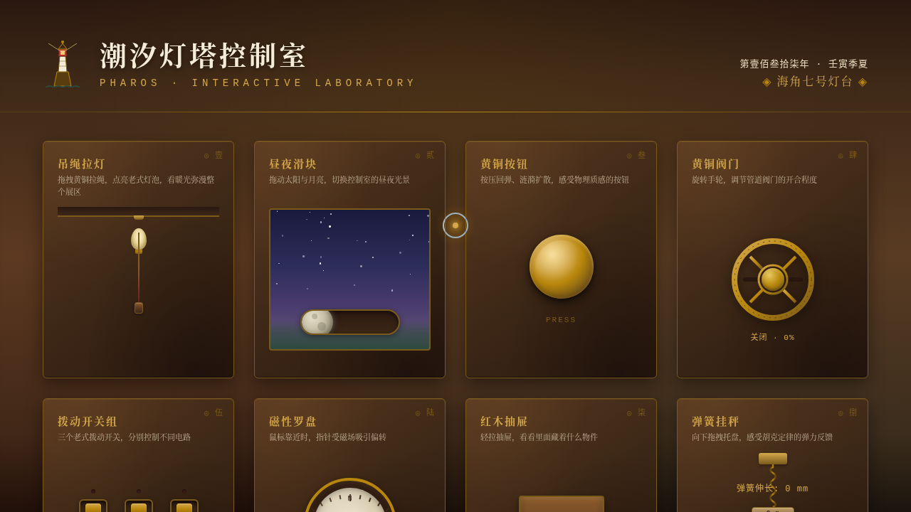

# 潮汐灯塔控制室

- 日期：2026-08-18
- 方向：V3 UX 交互设计（光标驱动拟物化小组件动画）
- 主题：1887 年海角灯塔控制室——复古航海拟物化微交互实验室
- 配色：黄铜金 #B8860B / 深海绿 #2D4A3E / 旧木棕 #7A5A1A / 赭石红 #C0392B，禁蓝紫渐变

## 简介

一座 1887 年的海角灯塔控制室，12 个光标驱动的拟物化微交互装置：吊绳拉灯（弹簧回弹+暖光扩散）、昼夜滑块（星空云朵过渡）、黄铜按钮（磁性吸附+涟漪）、旋转阀门（惯性阻尼）、拨动开关、磁性罗盘、红木抽屉、弹簧挂秤（胡克定律）、塔式节拍器、猫眼窥孔、无液气压表、刹车拉杆（四档卡位）。全部用鼠标光标悬停/点击/拖拽操作，物理质感细腻。

## 截图

## 动效亮点

12 个拟物化装置各基于不同物理模型：弹簧 Hooke、惯性动量、磁性反平方、阻尼衰减、简谐摆动；自定义黄铜光标三层缓动跟随，悬停变形、点击涟漪。

## 妙搭在线预览

https://dcniaqwtmoca.feishu.cn/page/DCkymJRz3dwunTa628VcLxHrnFb

## 文件说明

| 文件 | 说明 |
|---|---|
| index.html | 完整源码（纯 vanilla HTML/CSS/JS 单文件） |
| thumbnail.png | 应用截图 |
| 设计规范.md | 色彩/字体/装置/物理模型/健壮性规范 |

## 技术栈

纯 vanilla HTML/CSS/JS 单文件，无 React / 无 Babel / 无外部 CDN 依赖。
