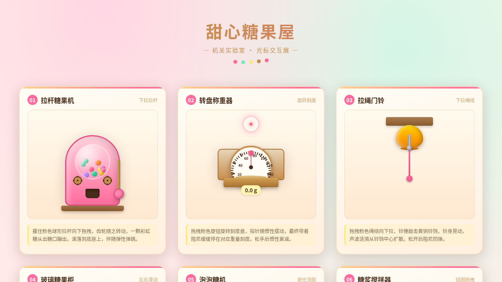

# 甜心糖果屋 — V3 UX 交互设计

**日期：** 2026-08-18
**方向：** V3 UX 交互设计
**主题：** 甜心糖果屋——糖果店机关交互实验室

## 简介

一间复古糖果店的机关实验室，每个展区是一个独立的、有场景叙事的拟物化微交互装置。明快糖果色调（草莓粉 + 薄荷绿 + 奶油黄 + 焦糖 + 巧克力），6 个光标驱动的物理质感装置：拉杆糖果机、转盘称重器、拉绳门铃、玻璃糖果柜、按压泡泡糖机、摇杆糖浆搅拌器。所有交互用鼠标光标悬停/点击/拖拽触发，反馈细腻有物理质感。

## 截图

## 动效亮点

- 自定义光标（白环 + 草莓粉内点 + 多层发光，悬停变薄荷绿，拖拽变焦糖色，点击涟漪）
- 6 个独立物理交互装置：拉杆齿轮联动+糖果弹跳、转盘指针阻尼惯性、拉绳铃铛弹簧+声波涟漪、柜门惯性摩擦、泡泡糖机螺旋上升、摇杆旋涡光泽
- 所有拖拽直接操作 DOM transform，RAF 积分器物理模型（弹簧/惯性/摩擦/阻尼/重力）
- 共 12+ 组件级动效

## 文件说明

| 文件 | 说明 |
|------|------|
| index.html | 完整可运行源码（纯 vanilla HTML/CSS/JS 单文件） |
| 设计规范.md | 色彩系统、字体、展区结构、动效系统 |
| preview.png | 页面截图 |
| thumbnail.png | 平台缩略图 |

## 妙搭在线预览

https://dcniaqwtmoca.feishu.cn/page/GpsSm6W66dLMS1aunQPcI7ShnY7

## 技术栈

纯 vanilla HTML/CSS/JS 单文件，无 React / 无 Babel / 无外部 CDN 依赖。RAF 随 visibilitychange 自动暂停，beforeunload 统一清理，支持 prefers-reduced-motion 全量降级。
