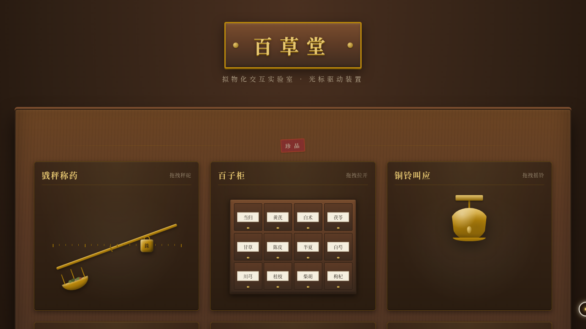

# 百草堂药铺 · V3 UX 交互设计

**日期**：2026-08-18
**方向**：UX 交互设计（V3）
**主题**：百草堂药铺（光标驱动拟物化小组件实验室）

## 简介
一间老式中药铺柜台上的拟物化微交互装置实验室。6 个展区均为光标悬停/点击/拖拽驱动的实体隐喻装置：戥秤称药（力矩平衡）、百子柜药屉（弹簧阻尼回弹）、铜铃叫应（单摆物理）、算盘记账（惯性碰撞）、碾槽碾药（来回拖动碎药）、拉绳灯（拽绳触发光影变化）。胡桃木深棕 + 艾草绿 + 黄铜金 + 宣纸米白的药铺美学。

## 截图

## 动效亮点
自定义光标（白环+黄铜内点+拖拽虚线旋转）、力矩平衡秤杆、弹簧阻尼药屉回弹、单摆铜铃+声波涟漪、惯性算珠碰撞、碾药粒子碎裂、拉绳灯光影扩散。统一 RAF 管理，visibilitychange 自动暂停。

## 妙搭在线预览
https://dcniaqwtmoca.feishu.cn/page/Su75m1TCwdWQSGa4ZeucbZ4lnmd

## 文件说明
| 文件 | 说明 |
|---|---|
| index.html | 完整可运行源码（纯 vanilla 单文件） |
| 设计规范.md | 色彩系统、字体、展区结构、动效系统 |
| preview.png | 页面截图 |
| thumbnail.png | 缩略图 |

## 技术栈
纯 vanilla HTML/CSS/JS 单文件，零外部依赖，RAF 物理积分器，支持 prefers-reduced-motion。
