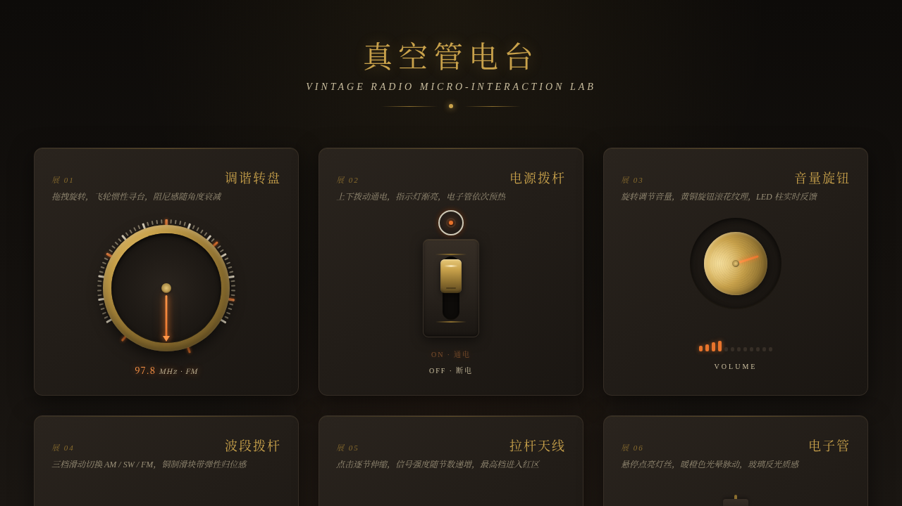

# 真空管电台 · 拟物化微交互实验室

> 日期：2026-08-18 · 方向：V3 UX 交互设计 · 主题：老式真空管收音机调谐台

## 简介

以「光标驱动的拟物化小组件动画」为展品的可把玩实验室。主题是一座老式真空管收音机的调谐台——8 个展区各为一台独立的拟物化微交互装置，全部用鼠标光标上手操作（悬停 / 点击 / 拖拽），交互反馈细腻、有物理质感、有场景叙事。

炭黑 + 黄铜金 + 暖橙 + 奶白刻度的配色，还原老式电台的金属质感与暖光氛围。纯 vanilla 单文件实现，无任何外部依赖。

## 展区一览（共 8 件）

| 展品 | 交互 | 物理细节 |
|------|------|----------|
| 调谐转盘 | 拖拽旋转 | 飞轮惯性衰减、阻尼感、频率实时显示 |
| 电源拨杆 | 点击切换 | 弹性归位、指示灯渐亮、联动电子管预热 |
| 音量旋钮 | 上下拖拽 | 黄铜滚花质感、12 格 LED 柱反馈 |
| 波段拨杆 | 点击切换 | 三档 AM/SW/FM、滑块弹性归位 |
| 拉杆天线 | 点击伸缩 | 5 节逐节伸出、信号强度递增、红区告警 |
| 电子管 | 悬停点亮 | 8 颗灯丝逐级点亮、暖橙光晕脉动 |
| 刻度表盘 | 左右拖拽 | 全频段刻度、电台标记高亮、红色指针 |
| 耳机插孔 | 拖拽插入 | 磁吸归位、触点发光、状态切换 |

## 动效亮点

- 自定义光标：开页即居中显示，白色粗环 + 暖橙内点 + 多层发光，悬停三态切换（拖拽 / 点击 / 旋钮），点击涟漪
- 飞轮惯性：旋钮松手后角速度按 friction 衰减，模拟真实阻尼
- 弹簧归位：拨杆 / 插头使用弹性缓动 cubic-bezier(.34,1.56,.64,1)
- 磁吸吸附：耳机插头距插孔 < 40px 时自动吸附归位
- LED 柱反馈：音量旋钮角度实时映射 12 格 LED 柱
- 灯丝逐级点亮：电子管 8 颗灯丝依次发光，暖橙光晕脉动
- 信号强度递增：天线逐节伸出，信号条随之上升，最高档红区告警
- prefers-reduced-motion 降级 + RAF 随可见性暂停

## 文件说明

| 文件 | 说明 |
|------|------|
| index.html | 完整单文件源码（内联 CSS + JS，纯 vanilla） |
| 设计规范.md | 色彩 / 字体 / 组件 / 动效规范 |
| preview.png | 页面截图 |
| README.md | 本文件 |

## 妙搭在线预览

https://dcniaqwtmoca.feishu.cn/page/YPjommUINd0Quha1RCUcaFR2nEb

## 技术栈

纯 vanilla HTML / CSS / JS 单文件，无 React / 无 Babel / 无外部 CDN 依赖。
