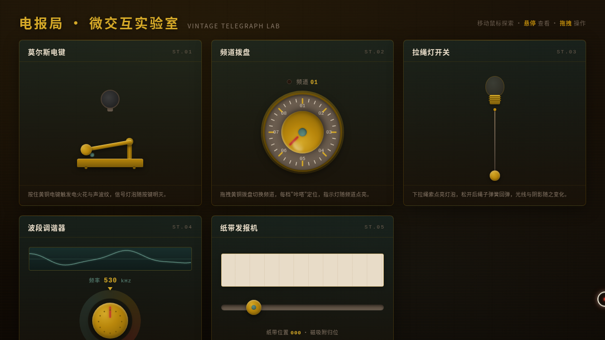

# 老式电报局 · V3 UX 交互设计

- 日期：2026-08-18
- 方向：V3 UX 交互设计（光标驱动的拟物化小组件动画实验室）
- 主题：老式电报局——黄铜机关与复古电器的微交互实验室
- 配色：深青灰 + 暗木褐 + 黄铜金 + 朱砂红 + 电火花白（禁止蓝紫渐变）

## 简介

一座充满黄铜机关的复古电报局，5 个展区各为一件可上手操作的拟物化装置。用鼠标光标悬停/点击/拖拽触发细腻微交互：按压莫尔斯电键迸出火花、拖拽拨盘旋转调频、拉绳点灯伴随光线扩散、旋钮调谐改变波形、拖拽滑块在纸带上打出莫尔斯码。每个装置都有物理质感与场景叙事。

## 动效亮点

- 自定义光标（白环 + 朱砂红内点 + 多层发光，三态切换，点击涟漪）
- 电火花粒子迸射（Canvas）+ 声波纹扩散
- 拨盘/旋钮旋转阻尼 + 档位咔嗒振动定位
- 拉绳弹簧回弹（Hooke 定律）+ 阻尼
- 滑块磁性吸附归位 + 纸带滚动打出莫尔斯码
- 灯泡脉冲发光 + 光线扩散 + AM 调制波形可视化

## 文件说明

| 文件 | 说明 |
|---|---|
| index.html | 完整源码（纯 vanilla HTML/CSS/JS 单文件） |
| 设计规范.md | 色彩系统、字体、组件、动效、展区结构 |
| thumbnail.png | 页面截图 |

## 妙搭在线预览

https://dcniaqwtmoca.feishu.cn/page/U77Bmiiztdv6l9aJqGkcgD9Wnfb

## 技术栈

纯 vanilla HTML/CSS/JS 单文件（无 React / 无 Babel / 无外部 CDN 依赖），从根本上规避白屏风险。
